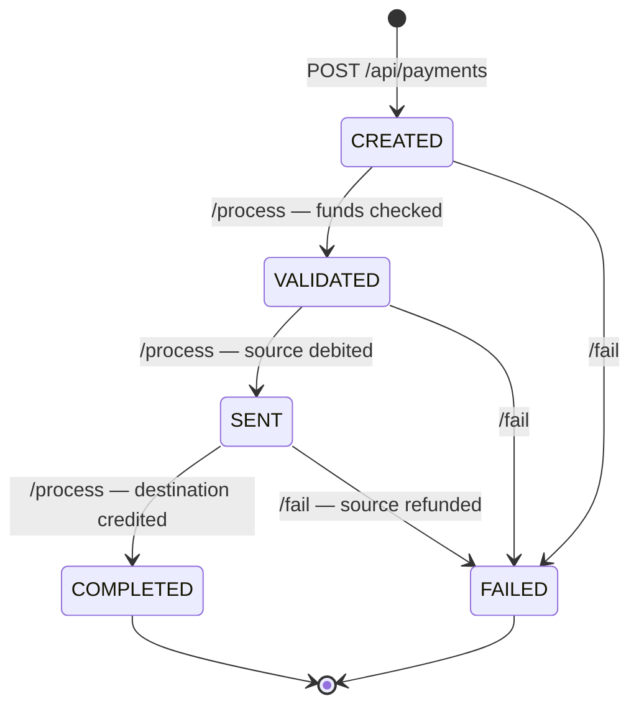
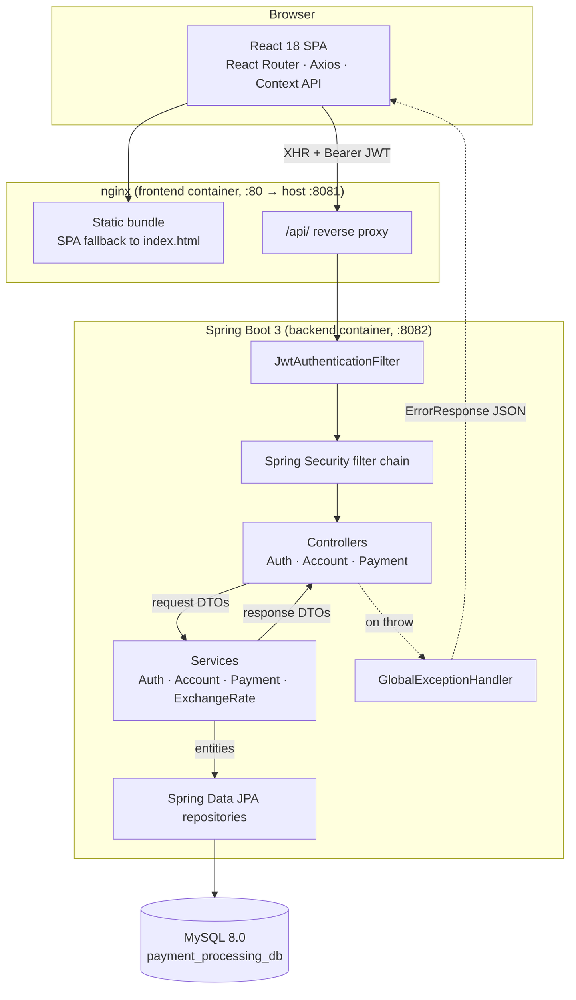
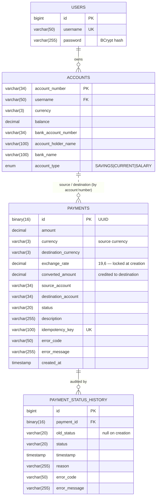
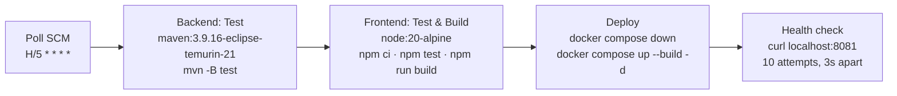

<div align="center">


# FlashPay — Payment Processing System

**A full-stack payment platform that takes a payment through its complete lifecycle — creation, validation, transmission and settlement — with a tamper-evident audit trail behind every state change.**

Spring Boot 3 · React 18 · MySQL 8 · JWT · Docker Compose · Jenkins CI/CD

[Quick Start](#-quick-start) · [API Reference](#-api-reference) · [Architecture](#-architecture) · [Deployment](#-deployment) 

</div>

---

## Table of Contents

- [What This Is](#-what-this-is)
- [Feature Highlights](#-feature-highlights)
- [Payment Lifecycle](#-payment-lifecycle)
- [Architecture](#-architecture)
- [Technology Stack](#-technology-stack)
- [Repository Layout](#-repository-layout)
- [Quick Start](#-quick-start)
- [Configuration Reference](#-configuration-reference)
- [Data Model](#-data-model)
- [API Reference](#-api-reference)
- [Error Code Catalogue](#-error-code-catalogue)
- [Business Rules](#-business-rules)
- [Security Model](#-security-model)
- [Frontend Guide](#-frontend-guide)
- [Demo Walkthrough](#-demo-walkthrough)
- [Testing](#-testing)
- [CI/CD Pipeline](#-cicd-pipeline)
- [Deployment](#-deployment)


---

## 🎯 What This Is

FlashPay implements the [Payments Processing System brief](payment_processing.md): a REST API that creates payments and tracks them through `CREATED → VALIDATED → SENT → COMPLETED`, with `FAILED` reachable from any non-terminal stage, and a full status-history record of every transition.

The delivered system goes considerably beyond the brief's minimum (which explicitly assumed a single user and no authentication). As built, it is a **multi-user platform**:

- Users register and authenticate with **JWT bearer tokens**.
- Each user owns **bank accounts** that carry real balances.
- Money **actually moves** between accounts at the correct lifecycle stages — and is refunded when a payment that had already left the source account fails.
- **Cross-currency transfers** are supported, with the exchange rate locked in at creation so the credited amount can never drift.
- Every read and write is **ownership-scoped**: a user can only see and move money touching their own accounts.

---

## ✨ Feature Highlights

| | Capability | Where |
|---|---|---|
| 🔐 | **JWT authentication** — register/login, BCrypt-hashed passwords, stateless sessions, 24h tokens | `com.payments.security`, `SecurityConfig` |
| 🏦 | **Bank accounts** — register accounts (savings / current / salary), per-account currency and balance | `AccountService` |
| 🔎 | **Payee search** — find a destination by account holder name across all users, without leaking balances or usernames | `GET /api/accounts/search` |
| 💸 | **Full payment lifecycle** — one-step-at-a-time state machine, terminal states structurally un-advanceable | `PaymentStatus.nextStatus()` |
| 📒 | **Immutable audit trail** — every transition recorded with old status, new status, timestamp, reason and error detail | `PaymentStatusHistory` |
| ♻️ | **Idempotency** — client-supplied key, unique-constrained in the DB, duplicate submissions rejected with `409` | `PaymentService.createPayment` |
| 🌍 | **Multi-currency** — USD / EUR / INR, rate + converted amount locked at creation time | `ExchangeRateService` |
| 💰 | **Real balance movement** — check at `VALIDATED`, debit at `SENT`, credit at `COMPLETED`, refund on failure after `SENT` | `PaymentService` |
| 🛡️ | **Ownership scoping** — foreign payments return `404`, never `403`, so resource existence is never confirmed | `findOwnedPaymentOrThrow` |
| 🧾 | **One error contract** — every failure, including security rejections, returns the same `{errorCode, message, timestamp}` shape | `GlobalExceptionHandler`, `RestAuthenticationEntryPoint` |
| 📊 | **Dashboard & analytics** — balance timeline chart, live status counts, credited/debited views | `Dashboard.js`, `AuditHistory.js` |
| 📚 | **Swagger/OpenAPI** — interactive, authorize-enabled API docs | `/swagger-ui.html` |
| 🐳 | **One-command deploy** — Docker Compose brings up MySQL + backend + nginx-served frontend | `docker-compose.yml` |
| 🔁 | **CI/CD** — Jenkins polls SCM, tests both tiers in throwaway containers, deploys, health-checks | `Jenkinsfile` |

---

## 🔄 Payment Lifecycle

```
CREATED ──▶ VALIDATED ──▶ SENT ──▶ COMPLETED
   │            │            │
   └────────────┴────────────┴──▶ FAILED
```

| Status | Meaning | Balance side-effect on entering |
|---|---|---|
| `CREATED` | Submitted, persisted, audit trail opened | None |
| `VALIDATED` | Funds confirmed available on the source account | None — **checked only** |
| `SENT` | Transmitted; the money has left the source | **Source debited** |
| `COMPLETED` | Settled and confirmed | **Destination credited** (converted amount, destination currency) |
| `FAILED` | Terminal failure, carries an error code + message | **Source refunded** — only if the payment had reached `SENT` |

Staging the money movement across three separate transitions mirrors a real payment rail: *authorize → transmit → settle* are genuinely distinct events with distinct failure modes. `COMPLETED` and `FAILED` are terminal — attempting to advance or fail them returns `400 INVALID_STATUS_TRANSITION`.



---

## 🏗 Architecture



**Layering rules that the code actually holds to:** controllers translate HTTP and nothing else, services own every business decision, repositories are pure data access. No layer skips or points backwards — controllers never touch repositories, services never see `HttpServletRequest`.

---

## 🛠 Technology Stack

### Backend

| Concern | Technology | Notes |
|---|---|---|
| Language | Java 17 | `pom.xml` → `<java.version>17</java.version>` |
| Framework | Spring Boot 3.1.5 | `spring-boot-starter-parent` |
| Web | Spring MVC | REST controllers, embedded Tomcat |
| Persistence | Spring Data JPA + Hibernate | `ddl-auto=update` |
| Database | MySQL 8.0 | `mysql-connector-j` |
| Test database | H2 (MySQL compatibility mode) | tests need no running MySQL |
| Security | Spring Security 6 | stateless, JWT bearer |
| Tokens | jjwt 0.11.5 | HS256, 24-hour expiry |
| Validation | Jakarta Bean Validation | annotation-driven on request DTOs |
| API docs | springdoc-openapi 2.1.0 | Swagger UI + OpenAPI 3 |
| Tests | JUnit 5 · Mockito · AssertJ · Spring Security Test | 70 tests |
| Build toolchain | Maven 3.9 / Temurin JDK 21 (containers) | compiles to Java 17 bytecode |

### Frontend

| Concern | Technology |
|---|---|
| Framework | React 18.2 (Create React App / react-scripts 5) |
| Routing | react-router-dom 6 |
| HTTP | Axios 1.4 with request/response interceptors |
| State | React Context (`AuthContext`, `AccountContext`) |
| Styling | Hand-written CSS (`App.css`), no UI framework |
| Charts | Inline SVG + CSS conic-gradient — zero chart dependencies |
| Serving | nginx:alpine (multi-stage Docker build) |

### Infrastructure

Docker (multi-stage builds, non-root runtime user) · Docker Compose · Jenkins declarative pipeline · nginx reverse proxy.

---

## 📁 Repository Layout

```
108-07-payment_processing/
├── backend/                                  Spring Boot REST API
│   ├── src/main/java/com/payments/
│   │   ├── PaymentProcessingApplication.java  Entry point
│   │   ├── config/                            SecurityConfig · OpenApiConfig · DataSeeder
│   │   ├── controller/                        AuthController · AccountController · PaymentController
│   │   ├── dto/                               12 request/response records + validation rules
│   │   ├── model/                             Payment · PaymentStatus · PaymentStatusHistory · Account · AccountType · User
│   │   ├── repository/                        4 Spring Data JPA interfaces
│   │   ├── security/                          JwtTokenProvider · JwtAuthenticationFilter · UserDetailsServiceImpl · RestAuthenticationEntryPoint
│   │   ├── service/                           AuthService · AccountService · PaymentService · ExchangeRateService
│   │   └── exception/                         7 custom exceptions + GlobalExceptionHandler
│   ├── src/main/resources/application.properties
│   ├── src/test/                              70 unit + integration tests (H2-backed)
│   ├── Dockerfile                             Multi-stage: Maven build → JRE runtime, non-root
│   └── pom.xml
│
├── frontend/                                 React SPA
│   ├── src/
│   │   ├── App.js                             Routes + auth/bank-account gating
│   │   ├── components/                        Login · Signup · Navbar · Dashboard · AuditHistory
│   │   │                                      AddBankAccount · CreatePayment · PaymentList · PaymentDetails
│   │   ├── context/                           AuthContext · AccountContext
│   │   └── services/                          api.js (axios client) · localAuth.js
│   ├── nginx.conf                             SPA fallback + /api/ reverse proxy
│   ├── Dockerfile                             Multi-stage: node build → nginx runtime
│   └── package.json
│
├── docker-compose.yml                        mysql + backend + frontend
├── Jenkinsfile                               Test → Build → Deploy → Health check
├── database.sql                              Chronological schema/migration script
├── .env.example                              Environment variable template
│
├── payment_processing.md                     Original project brief
├── backend_implementation.md                 Deep-dive backend guide (17 steps + appendices)
├── DTO_LAYER_DOCUMENTATION.md                DTO layer notes
└── backend/DATABASE_EXTENSION_DOCUMENTATION.md  Schema evolution notes
```

---

## 🚀 Quick Start

### Option A — Docker Compose (recommended)

Brings up MySQL, the API and the nginx-served frontend with a single command.

**Prerequisites:** Docker Engine 20.10+ with the Compose plugin.

```bash
# 1. Clone and enter the project
git clone <repository-url>
cd 108-07-payment_processing

# 2. Create your environment file (see .env.example for the template)
cat > .env << 'EOF'
MYSQL_DATABASE=payment_processing_db
MYSQL_USER=payment_user
MYSQL_PASSWORD=change-me
MYSQL_ROOT_PASSWORD=change-me-too

JWT_SECRET=replace-with-a-real-256-bit-secret-at-least-32-characters-long
CORS_ALLOWED_ORIGINS=http://localhost:8081

REACT_APP_API_BASE_URL=/api
EOF

# 3. Build and start everything
docker compose up --build -d

# 4. Watch it come up
docker compose ps
docker compose logs -f backend
```

| Service | URL |
|---|---|
| **Web app** | http://localhost:8081 |
| **API** | http://localhost:8082/api |
| **Swagger UI** | http://localhost:8082/swagger-ui.html |
| **OpenAPI JSON** | http://localhost:8082/api-docs |
| **MySQL** | `localhost:3306` |

The browser only ever talks to port **8081** — nginx reverse-proxies `/api/` to the backend over the internal Docker network, which is why `REACT_APP_API_BASE_URL=/api` (a relative path) is the correct value in this mode.

**Stopping / resetting:**

```bash
docker compose down          # stop, keep the database volume
docker compose down -v       # stop and wipe the database entirely
```

> **Note on `database.sql`:** it is mounted into MySQL's `/docker-entrypoint-initdb.d/` and therefore runs **only the first time** the `mysql_data` volume is created. On subsequent boots, Hibernate's `ddl-auto=update` reconciles the schema. To force a clean re-initialisation, use `docker compose down -v`.

---

### Option B — Local development

Run the tiers separately with hot reload on the frontend.

**Prerequisites:** JDK 17+, Maven 3.9+, Node.js 20+, MySQL 8.0 running locally.

**1. Database**

```bash
mysql -u root -p < database.sql
```

This creates `payment_processing_db`, the full schema, and the `payment_user` application account.

**2. Backend** (defaults to port **8080** in local mode)

```bash
cd backend
mvn spring-boot:run
```

Adjust `src/main/resources/application.properties` if your MySQL credentials differ, or override at launch:

```bash
mvn spring-boot:run \
  -Dspring-boot.run.arguments="--spring.datasource.username=payment_user --spring.datasource.password=yourpassword"
```

Swagger UI: http://localhost:8080/swagger-ui.html

**3. Frontend** (port **3000**)

```bash
cd frontend
npm install
npm start
```

`package.json` sets `"proxy": "http://localhost:8080"`, so with no `REACT_APP_API_BASE_URL` set the dev server forwards API calls to the local backend. The backend's default `app.cors.allowed-origins` is already `http://localhost:3000`.

---

## ⚙️ Configuration Reference

Every setting is an ordinary Spring property, so each one can be overridden by an environment variable using Spring Boot's relaxed binding (`app.jwt.secret` → `APP_JWT_SECRET`).

| Property | Local default | Docker value | Consumed by |
|---|---|---|---|
| `spring.datasource.url` | `jdbc:mysql://localhost:3306/payment_processing_db` | `jdbc:mysql://mysql:3306/…` (`SPRING_DATASOURCE_URL`) | Spring Boot |
| `spring.datasource.username` | `payment_user` | `${MYSQL_USER}` | Spring Boot |
| `spring.datasource.password` | `password123` | `${MYSQL_PASSWORD}` | Spring Boot |
| `spring.jpa.hibernate.ddl-auto` | `update` | unchanged | Hibernate |
| `server.port` | `8080` | `8082` (`SERVER_PORT`) | Embedded Tomcat |
| `app.jwt.secret` | dev placeholder | `${JWT_SECRET}` (`APP_JWT_SECRET`) | `JwtTokenProvider` |
| `app.jwt.expiration-ms` | `86400000` (24h) | unchanged | `JwtTokenProvider` |
| `app.cors.allowed-origins` | `http://localhost:3000` | `${CORS_ALLOWED_ORIGINS}` (`APP_CORS_ALLOWED_ORIGINS`) | `SecurityConfig` |
| `springdoc.swagger-ui.path` | `/swagger-ui.html` | unchanged | springdoc |
| `springdoc.api-docs.path` | `/api-docs` | unchanged | springdoc |

**Compose-level variables** (`.env` at the repository root):

| Variable | Purpose | Default in `docker-compose.yml` |
|---|---|---|
| `MYSQL_DATABASE` | Database name | `payment_processing_db` |
| `MYSQL_USER` / `MYSQL_PASSWORD` | Application DB credentials | `payment_user` / `password123` |
| `MYSQL_ROOT_PASSWORD` | MySQL root password | `rootpassword` |
| `JWT_SECRET` | HS256 signing key — **must be ≥ 32 characters** | insecure placeholder |
| `CORS_ALLOWED_ORIGINS` | Comma-separated allowed origins | `http://10.9.67.35:8081` |
| `REACT_APP_API_BASE_URL` | Baked into the React bundle at build time | `/api` |

> ⚠️ **All compose defaults are development placeholders.** `CORS_ALLOWED_ORIGINS` in particular defaults to a specific deployment host and must be set to your own origin. `.env` is git-ignored — never commit real secrets.

> ℹ️ `REACT_APP_*` variables are **inlined into the JavaScript bundle at build time** by Create React App. Changing `REACT_APP_API_BASE_URL` requires rebuilding the frontend image (`docker compose up --build frontend`), not just restarting it.

---

## 🗄 Data Model



**Design notes worth knowing:**

- Payments reference accounts by **account number string**, not a JPA relation. Every hot-path ownership check is then a plain string-list membership test — no join required.
- `idempotency_key` carries a **database-level unique constraint** (`uk_payments_idempotency_key`), so duplicate protection survives even a concurrent double-submit that races past the service check.
- `exchange_rate` and `converted_amount` are stored **per payment**, not derived at settlement — the credited amount can never drift from what was quoted at creation.
- The status history table is **append-only** in practice: rows are written on every transition and never updated.

---

## 📡 API Reference

Base URL: `http://localhost:8082/api` (Docker) or `http://localhost:8080/api` (local dev).

All routes require `Authorization: Bearer <token>` **except** `/api/auth/**` and the Swagger paths.

### Authentication

<details open>
<summary><b><code>POST /api/auth/register</code></b> — create an account and receive a token</summary>

```json
// Request
{ "username": "alice", "password": "Str0ng@Pass" }

// 201 Created
{ "token": "eyJhbGciOiJIUzI1NiJ9...", "tokenType": "Bearer" }
```

Username: 3–50 characters, `[a-zA-Z0-9_.-]` only. Password: minimum 6 characters (the UI enforces a stricter rule — see [Known Limitations](#-known-limitations--roadmap)).
Returns `409 USERNAME_ALREADY_EXISTS` if taken. A token is returned immediately, so no follow-up login call is needed.
</details>

<details>
<summary><b><code>POST /api/auth/login</code></b> — exchange credentials for a token</summary>

```json
// Request
{ "username": "alice", "password": "Str0ng@Pass" }

// 200 OK
{ "token": "eyJhbGciOiJIUzI1NiJ9...", "tokenType": "Bearer" }
```

Returns `401 INVALID_CREDENTIALS` on a bad username *or* password — the response never distinguishes the two.
</details>

### Accounts

<details>
<summary><b><code>POST /api/accounts</code></b> — register a bank account</summary>

```json
// Request
{
  "accountNumber": "123456789012",
  "currency": "USD",
  "accountHolderName": "Alice Fernandes",
  "bankName": "Northgate Bank",
  "accountType": "SAVINGS"
}

// 201 Created
{
  "accountNumber": "123456789012",
  "username": "alice",
  "currency": "USD",
  "balance": 0.00,
  "accountHolderName": "Alice Fernandes",
  "bankName": "Northgate Bank",
  "accountType": "SAVINGS"
}
```

`accountNumber` must be 6–34 digits and becomes the account's primary key. The owner is always taken from the JWT — never from the body. New accounts start at **0.00**; there is no deposit endpoint, so first funds must arrive via an incoming payment (see the [seeded demo accounts](#-demo-walkthrough)).
</details>

<details>
<summary><b><code>GET /api/accounts</code></b> — list the caller's accounts</summary>

Returns an array of `AccountResponse`, scoped to the authenticated user only.
</details>

<details>
<summary><b><code>GET /api/accounts/search?holderName=ali</code></b> — find a payee</summary>

```json
// 200 OK — public-safe fields only
[
  {
    "accountNumber": "123456789012",
    "accountHolderName": "Alice Fernandes",
    "currency": "USD",
    "bankName": "Northgate Bank",
    "accountType": "SAVINGS"
  }
]
```

Case-insensitive partial match across **every** user's accounts (a destination is usually someone else). Deliberately omits `username` and `balance`. Queries shorter than 2 characters return `[]`; results are capped at 20.
</details>

<details>
<summary><b><code>GET /api/accounts/{accountNumber}</code></b> — resolve one account's public details</summary>

Same public-safe shape as search. Used to redisplay an already-chosen destination (e.g. when retrying a failed payment) without a fresh name search. `404` if unknown.
</details>

### Payments

<details open>
<summary><b><code>POST /api/payments</code></b> — create a payment</summary>

```json
// Request
{
  "amount": 250.00,
  "currency": "USD",
  "sourceAccount": "900000000001",
  "destinationAccount": "123456789012",
  "description": "Invoice #4471",
  "idempotencyKey": "3f9c1e2a-7b45-4d0e-9c31-b0a2f8e51d77"
}

// 201 Created
{
  "id": "6a1f9d2c-88b3-4e7a-9f01-2d5c7e3b1a04",
  "amount": 250.00,
  "currency": "USD",
  "destinationCurrency": "USD",
  "exchangeRate": 1.000000,
  "convertedAmount": 250.00,
  "sourceAccount": "900000000001",
  "destinationAccount": "123456789012",
  "status": "CREATED",
  "description": "Invoice #4471",
  "idempotencyKey": "3f9c1e2a-7b45-4d0e-9c31-b0a2f8e51d77",
  "errorCode": null,
  "errorMessage": null,
  "createdAt": "2026-08-06T14:22:07.412"
}
```

The source account must **belong to the caller** and be **held in the payment's currency**. The destination may be held in a different currency — the rate and converted amount are locked in here. `idempotencyKey` is optional but strongly recommended; a repeat is rejected with `409 DUPLICATE_PAYMENT`.
</details>

<details>
<summary><b><code>GET /api/payments?status=COMPLETED</code></b> — list payments</summary>

Returns every payment where one of the caller's accounts is the source **or** destination. The optional `status` filter accepts `CREATED`, `VALIDATED`, `SENT`, `COMPLETED`, `FAILED`. A user with no accounts receives `[]`.
</details>

<details>
<summary><b><code>GET /api/payments/stats</code></b> — status counts</summary>

```json
{ "total": 12, "created": 1, "validated": 0, "sent": 2, "completed": 8, "failed": 1 }
```
</details>

<details>
<summary><b><code>GET /api/payments/{id}</code></b> — fetch one payment</summary>

Returns `404 PAYMENT_NOT_FOUND` both for unknown ids **and** for payments belonging to someone else — the API never confirms that another user's resource exists.
</details>

<details>
<summary><b><code>GET /api/payments/{id}/history</code></b> — the audit trail</summary>

```json
[
  { "oldStatus": null,       "status": "CREATED",   "timestamp": "2026-08-06T14:22:07.412", "reason": "Payment created",        "errorCode": null, "errorMessage": null },
  { "oldStatus": "CREATED",  "status": "VALIDATED", "timestamp": "2026-08-06T14:22:10.518", "reason": "Advanced to VALIDATED",  "errorCode": null, "errorMessage": null },
  { "oldStatus": "VALIDATED","status": "SENT",      "timestamp": "2026-08-06T14:22:13.604", "reason": "Advanced to SENT",       "errorCode": null, "errorMessage": null },
  { "oldStatus": "SENT",     "status": "COMPLETED", "timestamp": "2026-08-06T14:22:16.711", "reason": "Advanced to COMPLETED",  "errorCode": null, "errorMessage": null }
]
```

Oldest first. Every transition is present, including the initial creation.
</details>

<details>
<summary><b><code>POST /api/payments/{id}/process</code></b> — advance one step</summary>

No body. Moves the payment exactly one step along the happy path and applies that step's balance side-effect. `400 INVALID_STATUS_TRANSITION` if already terminal; `400 INSUFFICIENT_FUNDS` if the source can no longer cover the amount.
</details>

<details>
<summary><b><code>POST /api/payments/{id}/fail</code></b> — mark as failed</summary>

```json
// Request body is optional
{ "errorCode": "NETWORK_ERROR" }
```

Falls back to `PROCESSING_ERROR` when the body or `errorCode` is absent. Refunds the source account if the payment had reached `SENT`. `400 INVALID_STATUS_TRANSITION` if already `COMPLETED` or `FAILED`.
</details>

### Error response shape

Every failing request — including security rejections raised before any controller is reached — returns the same body:

```json
{
  "errorCode": "INSUFFICIENT_FUNDS",
  "message": "Source account 123456789012 has insufficient funds",
  "timestamp": "2026-08-06T14:31:52.883"
}
```

Clients branch on `errorCode` alone; the human-readable `message` may be reworded without breaking anyone.

---

## 🚨 Error Code Catalogue

| Error Code | HTTP | Raised when |
|---|---|---|
| `VALIDATION_FAILED` | 400 | Bean Validation failure on any request DTO |
| `INVALID_ACCOUNT` | 400 | Blank account number, non-existent account, or source == destination |
| `ACCOUNT_NOT_OWNED` | 400 | Source account does not belong to the caller |
| `INVALID_CURRENCY` | 400 | Not a real ISO-4217 code, or account/payment currency mismatch |
| `UNSUPPORTED_CURRENCY` | 400 | Valid ISO-4217 code but outside `{USD, EUR, INR}` |
| `AMOUNT_LIMIT_EXCEEDED` | 400 | Amount over the per-currency transaction cap |
| `INSUFFICIENT_FUNDS` | 400 | Source balance too low at `VALIDATED` or `SENT` |
| `INVALID_ACCOUNT_TYPE` | 400 | Account type is not `SAVINGS` / `CURRENT` / `SALARY` |
| `INVALID_STATUS_TRANSITION` | 400 | Advancing or failing an already-terminal payment |
| `PAYMENT_NOT_FOUND` | 404 | Unknown **or** not-owned payment id |
| `DUPLICATE_PAYMENT` | 409 | Reused idempotency key |
| `ACCOUNT_ALREADY_EXISTS` | 409 | Account number already registered |
| `USERNAME_ALREADY_EXISTS` | 409 | Username already registered |
| `INVALID_CREDENTIALS` | 401 | Wrong username or password at login |
| `UNAUTHORIZED` | 401 | Missing, invalid or expired bearer token on a protected route |
| `PROCESSING_ERROR` | 500 / 400 | Unexpected server error, or the default fail-reason when none is supplied |

---

## 📐 Business Rules

### Supported currencies and limits

| Currency | Max per payment | Rate per 1 USD |
|---|---|---|
| USD | 10,000 | 1.00 |
| EUR | 10,000 | 0.92 |
| INR | 100,000 | 83.30 |

Rates are a **static illustrative table** in `ExchangeRateService`, not live market data. Swapping in a real provider requires changing only that one class — `getRate()` moves from a lookup to an API call and nothing else in the payment flow changes.

### Validation split

Field-shape rules live on the DTOs (Bean Validation); rules that span fields or depend on stored data live in the service, because Bean Validation cannot express them.

| Rule | Enforced in |
|---|---|
| Amount required, positive, ≤ 2 decimal places, ≤ 7 integer digits | `PaymentRequest` (DTO) |
| Currency is exactly 3 characters | `PaymentRequest` (DTO) |
| Account number is 6–34 digits | `AccountRequest` (DTO) |
| Username 3–50 chars, restricted character set | `RegisterRequest` (DTO) |
| Currency is a real ISO-4217 code and supported | `PaymentService.normaliseCurrency` |
| Amount within the per-currency cap | `PaymentService.ensureAmountWithinLimit` |
| Source ≠ destination | `PaymentService.createPayment` |
| Both accounts exist | `PaymentService.findAccountOrThrow` |
| Source account owned by the caller | `PaymentService.createPayment` |
| Source account currency matches the payment currency | `PaymentService.ensureCurrencyMatches` |
| Sufficient funds (re-checked at `VALIDATED` **and** `SENT`) | `PaymentService.checkFundsAvailable` / `debitSourceAccount` |
| Status transition is legal | `PaymentStatus.nextStatus()` |
| Idempotency key unused | `PaymentService` + DB unique constraint |

### Idempotency

The client supplies `idempotencyKey`; a blank value is treated as absent. If the key already exists, creation is rejected with `409 DUPLICATE_PAYMENT` rather than silently creating a second payment. The frontend generates a fresh UUID per form mount, so a deliberate retry of a failed payment is a genuinely new attempt — while the database's unique constraint guarantees a key can never produce two payments even under a concurrent double-submit.

---

## 🔐 Security Model

| Layer | Mechanism |
|---|---|
| Password storage | BCrypt (per-hash salt, deliberately slow) |
| Sessions | None — `SessionCreationPolicy.STATELESS` |
| Tokens | JWT HS256, subject = username, 24-hour expiry |
| Token transport | `Authorization: Bearer <token>` header |
| CSRF | Disabled by design — no cookies are used for auth, so there is nothing for a cross-site request to ride on |
| CORS | Explicit allow-list from `app.cors.allowed-origins` |
| Authorization | Every route authenticated except `/api/auth/**` and Swagger paths |
| Ownership | Enforced in the service layer against the JWT principal, never a request parameter |
| Information disclosure | Foreign payments `404` (not `403`); payee search omits balance and username; login errors do not distinguish unknown user from wrong password |
| Container | Backend runs as a non-root `spring` user in a JRE-only image |

**Request flow:** `JwtAuthenticationFilter` runs once per request, and if a valid token is present it populates the security context — it never rejects anything itself. All access decisions stay in `SecurityConfig`, so a public endpoint can't accidentally become protected (or vice versa) by a filter-level change.

---

## 🖥 Frontend Guide

### Routes

| Route | Screen | Guard |
|---|---|---|
| `/signup` | Create account, live password-strength checklist | Redirects to `/dashboard` if already signed in |
| `/login` | Sign in | Redirects to `/dashboard` if already signed in |
| `/add-bank-account` | Register a bank account, list existing ones | Requires auth |
| `/dashboard` | Balance timeline chart, account cards, status tiles | Requires auth **+ at least one bank account** |
| `/payments` | Payment list with status and credited/debited filters, search | Requires auth + account |
| `/payments/new` | Create payment with debounced payee search | Requires auth + account |
| `/payments/:id` | Payment detail, lifecycle progress, audit timeline, retry | Requires auth + account |
| `/audit-history` | Aggregate status analytics with a completed/failed pie | Requires auth + account |

New users are funnelled through `RequireBankAccount`: until they register an account, every app route redirects to `/add-bank-account`. Without an account there are no payments to see and none can be created, so this removes an otherwise-empty first-run experience.

### Notable frontend behaviour

- **Automatic lifecycle progression.** Opening a non-terminal payment's detail page auto-advances it one stage every 3 seconds with a visible countdown, so the full lifecycle plays out without manual clicking. If a stage throws a business-rule error (e.g. insufficient funds), the UI explicitly calls `/fail` so the outcome is persisted to the audit trail — mirroring what a real processor would do — and surfaces a failure modal with the stage, error code and description.
- **Payee search.** The destination field searches by account holder name after a 300 ms debounce and a 2-character minimum, matching the backend's own threshold.
- **Retry.** A failed payment offers "Retry Payment", which reopens the create form pre-filled with the original details and a brand-new idempotency key.
- **Session handling.** The axios response interceptor flattens the backend's `ErrorResponse` onto `error.code` / `error.message`, and on any non-auth `401` clears the stored token and redirects to `/login`.
- **Resizable sidebar.** The navigation width is drag-adjustable and persisted in `localStorage`.
- **Zero chart dependencies.** The balance timeline is hand-rolled inline SVG; the status breakdown is a CSS `conic-gradient`.

---

## 🎬 Demo Walkthrough

On every startup, `DataSeeder` idempotently creates a demo funding user with four pre-funded accounts (10,000.00 each) — since real accounts start at zero and there is no deposit endpoint, this solves the bootstrap problem.

**Demo credentials:** `dummy_bank` / `Dummy@12345` — *local testing only.*

| Account number | Currency | Type | Balance |
|---|---|---|---|
| `900000000001` | USD | SAVINGS | 10,000.00 |
| `900000000002` | EUR | CURRENT | 10,000.00 |
| `900000000003` | INR | SALARY | 10,000.00 |
| `900000000004` | USD | CURRENT | 10,000.00 |

### A five-minute demo

1. **Register** `alice` and add a USD bank account — balance starts at `0.00`.
2. **Sign in as `dummy_bank`** and send **250.00 USD** from `900000000001` to Alice's account. Watch the detail page walk `CREATED → VALIDATED → SENT → COMPLETED`. The source drops to 9,750.00 only at `SENT`; Alice is credited only at `COMPLETED`.
3. **Back as `alice`**, send **100.00 USD** to the EUR account `900000000002`. The rate `0.92` and converted amount `92.00 EUR` are locked in at creation and shown on the payment; the EUR account is credited 92.00, not 100.00.
4. **Demonstrate failure and refund.** Create a third payment, let it reach `SENT` (Alice is debited), then call `/fail`. Her balance is restored and the audit trail gains a `SENT → FAILED` row carrying the error code.
5. **Show the audit trail** on any payment — every transition, timestamped, oldest first.

This one scenario exercises ownership enforcement, same-currency and cross-currency transfers, rate locking, all three balance-moving transitions, and the terminal failure/refund path.

---

## 🧪 Testing

```bash
cd backend
mvn test                                    # full suite
mvn test -Dtest=PaymentServiceTest          # one class
mvn test -Dtest=PaymentServiceTest#advance_validatedToSent_debitsSourceAccount
```

**70 tests across 7 classes**, all backed by in-memory H2 — no running MySQL required.

| Suite | Tests | Covers |
|---|---|---|
| `PaymentServiceTest` | 27 | Creation, validation, cross-currency conversion, every transition, balance movement, refunds, ownership scoping |
| `AccountServiceTest` | 11 | Creation, duplicates, invalid types/currencies, payee search bounds and field masking |
| `ExchangeRateServiceTest` | 7 | Rate table, inverses, case handling, rounding, unsupported currencies |
| `AuthServiceTest` | 4 | Registration, duplicate usernames, token issuance, credential failures |
| `PaymentControllerIntegrationTest` | 8 | End-to-end lifecycle over HTTP, 401s, ownership, idempotency conflicts, refunds, stats |
| `AccountControllerIntegrationTest` | 7 | Auth enforcement, duplicates, caller scoping, search leak prevention |
| `AuthControllerIntegrationTest` | 6 | Register/login status codes, validation and credential failures |

**Frontend:**

```bash
cd frontend
CI=true npm test -- --watchAll=false --passWithNoTests
```

---

## 🔁 CI/CD Pipeline

`Jenkinsfile` defines a declarative pipeline that runs on the same host as the application (`agent any`), executing each build step inside a throwaway container. The Jenkins host therefore needs **only Docker** — no JDK, Maven or Node toolchain installed.



| Detail | Behaviour |
|---|---|
| Trigger | `pollSCM('H/5 * * * *')` — checks every ~5 minutes, builds only on change; `H` spreads load off the exact minute |
| Concurrency | `disableConcurrentBuilds()` — no two deploys racing on the same host |
| History | Last 20 builds retained, timestamped logs |
| Maven cache | Named volume `jenkins_maven_repo` mounted at `/root/.m2`, so dependencies are not re-downloaded every build |
| Test reporting | Surefire XML published via `junit`, `allowEmptyResults: true` |
| Deploy | `docker compose up --build -d` on the same host — no image registry involved |
| Health gate | Fails the build and dumps `docker compose logs --tail=100` if the frontend is not reachable within ~30 seconds |

**Jenkins setup:** create a Pipeline job pointing at this repository with *Pipeline script from SCM*, ensure the Jenkins user is in the `docker` group, and place the `.env` file in the workspace (or configure the variables at the job level) before the first deploy.

---

## 🚢 Deployment

### Pre-production checklist

- [ ] **Replace `JWT_SECRET`** with a securely generated value of at least 32 characters (`openssl rand -base64 48`). The compose default is a public placeholder.
- [ ] **Replace all MySQL passwords** — `MYSQL_PASSWORD` and `MYSQL_ROOT_PASSWORD`.
- [ ] **Set `CORS_ALLOWED_ORIGINS`** to your real frontend origin. The default points at a specific development host.
- [ ] **Confirm `.env` is not committed** — it is git-ignored, and should stay that way.
- [ ] **Terminate TLS in front of nginx.** Nothing in this stack serves HTTPS; without it, JWTs travel in clear text. This also restores `crypto.randomUUID()` in the browser (the frontend already carries a fallback for insecure contexts).
- [ ] **Do not expose MySQL publicly** — remove the `3306:3306` port mapping unless external access is genuinely required.
- [ ] **Consider `ddl-auto=validate`** instead of `update` in production, with schema changes applied through a migration tool (Flyway/Liquibase) rather than Hibernate.
- [ ] **Disable or protect `DataSeeder`** — it creates a known-credential demo user on every startup.
- [ ] **Restrict Swagger UI** if the API is internet-facing; it is currently publicly readable by design.
- [ ] **Set up log aggregation and database backups** (the `mysql_data` named volume is the only durable state).

### Operations

```bash
docker compose ps                      # service status
docker compose logs -f backend         # follow API logs
docker compose restart backend         # restart one service
docker compose up --build -d frontend  # rebuild after changing REACT_APP_* values
docker compose exec mysql mysql -u payment_user -p payment_processing_db   # DB shell
```

### Troubleshooting

| Symptom | Cause and fix |
|---|---|
| Backend exits at startup | MySQL not healthy yet, or wrong credentials. Compose already gates on the healthcheck — check `docker compose logs mysql`. |
| Browser console shows CORS errors | `CORS_ALLOWED_ORIGINS` does not match the origin actually used. It must match scheme, host **and** port exactly. |
| API calls 404 from the browser | `REACT_APP_API_BASE_URL` was changed without rebuilding the frontend image — CRA inlines it at build time. |
| Login succeeds, then every call 401s | `JWT_SECRET` changed since the token was issued, or the 24-hour expiry elapsed. Sign in again. |
| Schema changes in `database.sql` not applied | The init script runs only on first volume creation. `docker compose down -v` to re-initialise (**destroys all data**). |
| Port already in use | Another process holds 8081/8082/3306 — change the host-side port mapping in `docker-compose.yml`. |

---

## ⚠️ Known Limitations & Roadmap

Documented deliberately — these are conscious scope boundaries, not oversights.

**Functional**

- **No retry/backoff.** Advancing a payment is a single synchronous call; a transient failure must be retried by the client or the payment failed manually.
- **Exchange rates are a static table**, not live market data (flagged in `ExchangeRateService`'s own Javadoc).
- **No deposit or withdrawal.** Accounts start at `0.00` and can only receive funds via a payment — hence the seeded demo accounts.
- **No pagination.** `GET /api/payments` returns the caller's entire history in one response.
- **No role-based authorization.** Every user gets exactly one implicit role (`ROLE_USER`); there is no admin/support view across accounts.
- **No payment cancellation or reversal**, no batch payments, no scheduling, no notifications.
- **No optimistic locking.** A `version` column existed in an early migration and was dropped; concurrent updates to the same payment are not currently guarded.

**Next steps if the project continued**

Pagination and sorting on the payment list · Flyway migrations replacing `ddl-auto=update` · a live exchange-rate provider with caching · refresh tokens and shorter access-token lifetimes · admin role and cross-account operations view · optimistic locking on `Payment` · webhook/email notifications on status change · frontend component test coverage.


<div align="center">

**FlashPay** — built for the Payment Processing training project (Group 108-07).

</div>
