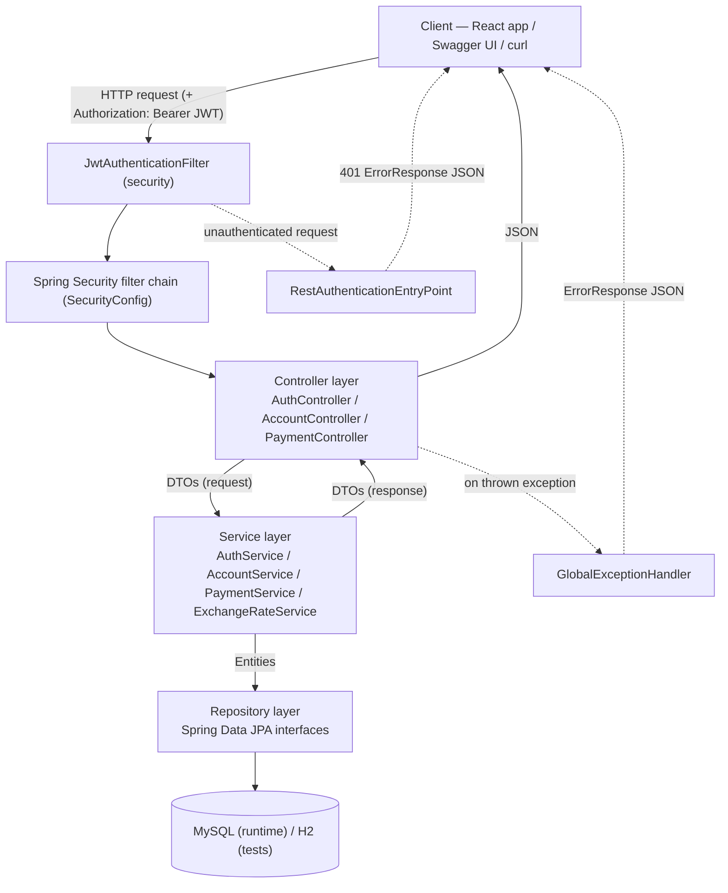
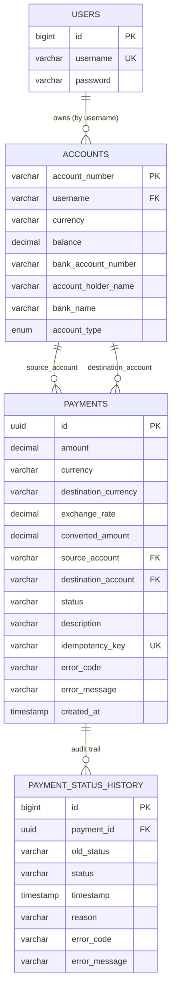
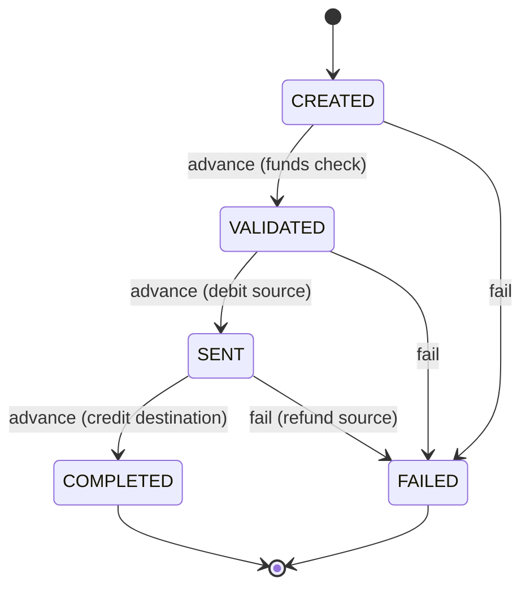
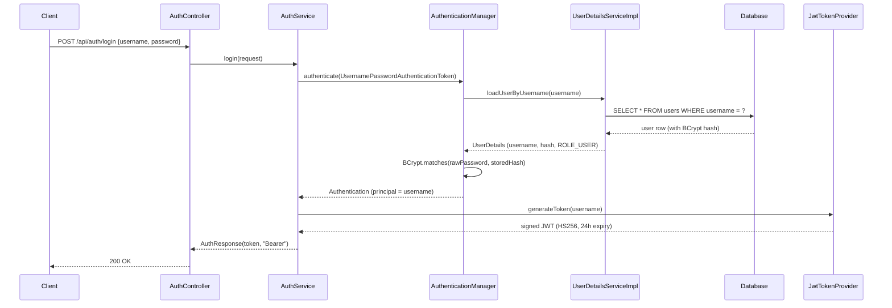
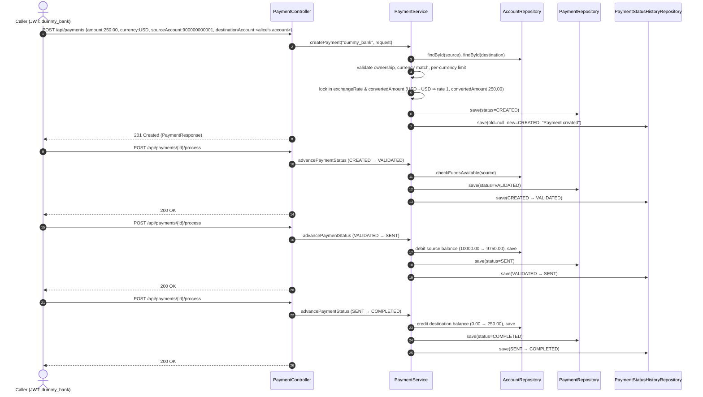

# Backend Implementation Guide — FlashPay Payment Processing API

> A ground-up, step-by-step walkthrough of the Spring Boot backend in this repository: what it does, how every package fits together, and why it was built this way. Written so it can be read once to fully understand the system, and used again as presentation notes.

## How to read this document

The steps below are ordered the way you'd want to **learn** the system, not the order the files sit alphabetically on disk: start from the brief, then the plumbing (build + config), then the data model, then persistence, then the API contracts, then security, then business logic, then the HTTP surface, then error handling, then testing and deployment, and finally a worked end-to-end example and a presentation cheat-sheet. Each step is self-contained but builds on the previous one.

**Table of Contents**

- [Step 0 — Project Origin & Brief](#step-0--project-origin--brief)
- [Step 1 — Technology Stack & High-Level Architecture](#step-1--technology-stack--high-level-architecture)
- [Step 2 — Project Bootstrap: Build File, Entry Point, Configuration](#step-2--project-bootstrap-build-file-entry-point-configuration)
- [Step 3 — Domain Model (Entities)](#step-3--domain-model-entities)
- [Step 4 — Database Schema & Its Evolution](#step-4--database-schema--its-evolution)
- [Step 5 — Repository Layer (Data Access)](#step-5--repository-layer-data-access)
- [Step 6 — DTO Layer (API Contracts)](#step-6--dto-layer-api-contracts)
- [Step 7 — Security Architecture](#step-7--security-architecture)
- [Step 8 — Service Layer (Business Logic)](#step-8--service-layer-business-logic)
- [Step 9 — Controller Layer (REST API Surface)](#step-9--controller-layer-rest-api-surface)
- [Step 10 — Error Handling & Validation Strategy](#step-10--error-handling--validation-strategy)
- [Step 11 — Cross-Cutting Concerns (Swagger, Demo Data, Logging)](#step-11--cross-cutting-concerns-swagger-demo-data-logging)
- [Step 12 — Testing Strategy](#step-12--testing-strategy)
- [Step 13 — Build, Packaging & Deployment](#step-13--build-packaging--deployment)
- [Step 14 — End-to-End Walkthrough: The Life of a Payment](#step-14--end-to-end-walkthrough-the-life-of-a-payment)
- [Step 15 — Key Design Decisions (Quick-Reference)](#step-15--key-design-decisions-quick-reference)
- [Step 16 — Known Limitations & Possible Next Steps](#step-16--known-limitations--possible-next-steps)
- [Step 17 — Presenting This Project (Talking-Points Cheat Sheet)](#step-17--presenting-this-project-talking-points-cheat-sheet)
- [Appendix A — File-by-File Inventory](#appendix-a--file-by-file-inventory)
- [Appendix B — Error Code Catalogue](#appendix-b--error-code-catalogue)
- [Appendix C — Configuration Property Reference](#appendix-c--configuration-property-reference)

---

## Step 0 — Project Origin & Brief

This backend implements the **Payments Processing System** training project brief (see [payment_processing.md](../payment_processing.md)). The brief asked for a REST API that manages a payment through a fixed lifecycle, with a full audit trail of every status change:

```
CREATED → VALIDATED → SENT → COMPLETED
                  ↓
              FAILED (can occur at any stage before COMPLETED)
```

The brief's own notes explicitly said authentication was **not** required ("a single user is assumed"). This implementation deliberately goes beyond that minimum: it adds full user registration/login, JWT-based authentication, per-user bank accounts, ownership scoping (a user can only move money out of their own accounts), and multi-currency support with locked exchange rates. Those are the enhancements referenced by the brief's "further enhancements" phase, and they are the reason the backend is organized the way it is described below — a payment cannot exist without an authenticated owner and two real accounts behind it.

Everything from here on describes the system **as built**, not just as specified.

---

## Step 1 — Technology Stack & High-Level Architecture

### 1.1 Stack

| Concern | Technology | Notes |
|---|---|---|
| Language / runtime | Java 17 | `pom.xml` → `<java.version>17</java.version>` |
| Framework | Spring Boot 3.1.5 | via `spring-boot-starter-parent` |
| Web layer | Spring MVC (`spring-boot-starter-web`) | REST controllers, embedded Tomcat |
| Persistence | Spring Data JPA + Hibernate (`spring-boot-starter-data-jpa`) | Entity mapping, repositories |
| Database (runtime) | MySQL 8.0 | via `mysql-connector-j` driver |
| Database (tests) | H2 in-memory (MySQL compatibility mode) | so tests need no external DB |
| Security | Spring Security 6 (`spring-boot-starter-security`) | stateless, JWT-based |
| Tokens | `jjwt` (io.jsonwebtoken) 0.11.5 | API + Impl + Jackson modules |
| Validation | Jakarta Bean Validation (`spring-boot-starter-validation`) | annotation-based request validation |
| API docs | springdoc-openapi-starter-webmvc-ui 2.1.0 | Swagger UI at `/swagger-ui.html` |
| Boilerplate reduction | Lombok (optional) | present as a dependency, excluded from the final jar |
| Testing | JUnit 5, Mockito, AssertJ, Spring Security Test | unit + integration tests |
| Containerization | Docker (multi-stage build), Docker Compose | `mysql` + `backend` + `frontend` services |

### 1.2 Layered architecture

The backend is a classic layered Spring Boot application. Every arrow below is a real dependency direction in the code — nothing skips a layer, and nothing points backwards (controllers never touch repositories directly, for example):



### 1.3 Package map

All source lives under `com.payments` (root package, matches the Maven `groupId`):

| Package | Responsibility |
|---|---|
| `com.payments` | Application entry point (`PaymentProcessingApplication`) |
| `com.payments.config` | Framework wiring: security rules, Swagger docs, startup demo-data seeding |
| `com.payments.controller` | HTTP endpoints — translate requests/responses, no business logic |
| `com.payments.dto` | Request/response records + Bean Validation rules — the API's public contract |
| `com.payments.model` | JPA entities and enums — the persisted domain model |
| `com.payments.repository` | Spring Data JPA interfaces — the only classes that talk to the database |
| `com.payments.security` | JWT issuing/validation, the authentication filter, Spring Security glue |
| `com.payments.service` | All business rules: validation, state transitions, balance movement, audit trail |
| `com.payments.exception` | Custom exception types + the single global exception-to-HTTP mapping |

This mirrors a standard **Controller → Service → Repository** design: controllers are intentionally "dumb" (HTTP in, HTTP out), services own every business decision, and repositories are pure data access with no logic of their own.

---

## Step 2 — Project Bootstrap: Build File, Entry Point, Configuration

### 2.1 Entry point

[PaymentProcessingApplication.java](src/main/java/com/payments/PaymentProcessingApplication.java) is the minimum possible Spring Boot bootstrap:

```java
@SpringBootApplication
public class PaymentProcessingApplication {
    public static void main(String[] args) {
        SpringApplication.run(PaymentProcessingApplication.class, args);
    }
}
```

`@SpringBootApplication` combines `@Configuration`, `@EnableAutoConfiguration` and `@ComponentScan`. Because this class sits at the root package `com.payments`, component scanning automatically picks up every `@Component`/`@Service`/`@Repository`/`@RestController`/`@Configuration` in every sub-package described in Step 1.3 — there is no manual bean registration anywhere in the project.

### 2.2 Build file (`pom.xml`)

Key points beyond the dependency table in Step 1.1:

- Parent POM `spring-boot-starter-parent:3.1.5` supplies dependency version management, so most dependencies above (Web, Data JPA, Security, Validation, Test) don't specify a version — Spring Boot picks one that is known to work together.
- The `jjwt` and `springdoc` dependencies **do** pin explicit versions, because they are not managed by the Spring Boot BOM.
- `jjwt-impl` and `jjwt-jackson` are `runtime` scoped — the code only compiles against the `jjwt-api` interfaces (see [JwtTokenProvider](#73-jwttokenprovider)), keeping the implementation swappable in theory.
- `h2` is `test` scoped only — it never ships in the production jar, it exists purely so the test suite has a real, disposable relational database.
- The `spring-boot-maven-plugin` explicitly excludes Lombok from the repackaged jar (Lombok is a compile-time annotation processor; it has nothing to contribute at runtime).

### 2.3 Application configuration (`application.properties`)

[application.properties](src/main/resources/application.properties) is the single source of runtime configuration for local/dev use (Docker overrides some of it via environment variables — see Step 13):

| Property | Value | Meaning |
|---|---|---|
| `spring.application.name` | `payment-processing` | Cosmetic — shows up in logs/actuator if enabled |
| `spring.sql.init.mode` | `always` | Would run `schema.sql`/`data.sql` from the classpath if present; no such files exist today, so this is currently a no-op placeholder |
| `spring.datasource.url` | `jdbc:mysql://localhost:3306/payment_processing_db...` | Local MySQL connection |
| `spring.datasource.username` / `password` | `payment_user` / `password123` | Matches the demo credentials created in [database.sql](../database.sql) |
| `spring.jpa.hibernate.ddl-auto` | `update` | Hibernate creates/adjusts tables to match the entities automatically; it never drops or truncates data between restarts |
| `spring.jpa.show-sql` / `format_sql` | `true` | Every generated SQL statement is logged, formatted, for local debugging |
| `server.port` | `8080` | Default local port; overridden to `8082` in the Docker deployment (Step 13) |
| `app.jwt.secret` | placeholder 32+ char string | HMAC-SHA256 signing key, read by `JwtTokenProvider` |
| `app.jwt.expiration-ms` | `86400000` (24 hours) | Token lifetime |
| `springdoc.api-docs.path` | `/api-docs` | Where the raw OpenAPI JSON is served |
| `springdoc.swagger-ui.path` | `/swagger-ui.html` | Where the interactive docs UI is served |
| `app.cors.allowed-origins` | `http://localhost:3000` | Comma-separated list consumed by `SecurityConfig` (Step 7) |

Every one of these is a `@Value`-injected property somewhere in the code (`JwtTokenProvider`, `SecurityConfig`) or a framework-native Spring Boot property (datasource, JPA, server, springdoc) — nothing here is unused.

---

## Step 3 — Domain Model (Entities)

Six classes make up the persisted domain model, in `com.payments.model`. All entity classes use plain JPA annotations with hand-written getters/setters (no Lombok at runtime, consistent with Step 2.2).

### 3.1 Entity-relationship overview



Note that `ACCOUNTS.username → USERS.username` is a foreign key on a **unique but non-primary** column (see Step 4), and a `Payment` references two account numbers (`source_account`, `destination_account`) rather than using JPA `@ManyToOne` relationships to `Account` — they're plain string columns. This is a deliberate simplicity trade-off: payments only ever need the account *number* to move balances (Step 8.4), never a full object graph, so modelling it as a relationship would add JPA complexity (lazy-loading, cascades) for no behavioural benefit.

### 3.2 `User`

[User.java](src/main/java/com/payments/model/User.java) — the authentication identity. Just an id, a unique `username`, and a `password` column that always holds a **BCrypt hash**, never plaintext (enforced by `AuthService`/`DataSeeder`, never by the entity itself).

### 3.3 `Account` / `AccountType`

[Account.java](src/main/java/com/payments/model/Account.java) — a bank account owned by a user.

- `accountNumber` is the **primary key** (`@Id`), not a generated surrogate id — it is a real-world identifier the client chooses at creation time (validated as 6–34 digits, see Step 6) and the same value is reused everywhere a payment needs to reference "this account" (`sourceAccount`/`destinationAccount` on `Payment`).
- `username` is a plain string copy of the owner's username rather than a `@ManyToOne` to `User`. Every ownership check in the service layer (Step 8) is therefore a simple string comparison against the authenticated principal's name — no join needed for the hot path of "does this account belong to this caller".
- `balance` is `BigDecimal` with `precision=19, scale=2` — money is never represented as a floating-point type anywhere in this codebase, avoiding binary floating-point rounding errors.
- `bankAccountNumber`, `accountHolderName`, `bankName`, `accountType` are descriptive "real bank" fields added so a payment destination can be searched/displayed meaningfully (Step 8.2), on top of the minimal fields the training brief asked for.
- [AccountType.java](src/main/java/com/payments/model/AccountType.java) is a plain enum: `SAVINGS`, `CURRENT`, `SALARY`. Stored as its string name (`@Enumerated(EnumType.STRING)`) rather than its ordinal, so reordering the enum in code can never silently corrupt existing rows.

### 3.4 `Payment` / `PaymentStatus`

[Payment.java](src/main/java/com/payments/model/Payment.java) — one money movement between two accounts.

- `id` is a **`UUID`**, generated by `GenerationType.UUID` (database-agnostic, generated in the JPA layer, not by an auto-increment column). Using a UUID rather than a sequential id means payment ids are not guessable/enumerable by an attacker probing `/api/payments/{id}`.
- `amount`/`currency` describe what leaves the source account; `destinationCurrency`/`exchangeRate`/`convertedAmount` describe what the destination account receives, if held in a different currency. All three of the conversion fields are computed and frozen **once, at creation time** (Step 8.4) — they never get recalculated later, which is what guarantees the amount actually credited on `COMPLETED` matches what was quoted when the payment was made, even if market rates were live and moved in between.
- `status` defaults to `CREATED` in the field declaration itself (`private PaymentStatus status = PaymentStatus.CREATED;`), so a `new Payment()` is never in an invalid, null status.
- `idempotencyKey` is optional (nullable) but unique at the database level (Step 4) — the actual duplicate check still happens in the service (Step 8.4) so the API can return a clean `409 Conflict` instead of a raw database constraint-violation error.
- `errorCode`/`errorMessage` hold the payment's **current** failure reason (only meaningful when `status == FAILED`); this is distinct from `PaymentStatusHistory`, which records the reason **at the time of each transition**, including transitions that were never failures.
- `createdAt` is stamped by a `@PrePersist` hook (`onCreate()`), guaranteeing every payment has a creation timestamp set by the server, never trusted from client input.

[PaymentStatus.java](src/main/java/com/payments/model/PaymentStatus.java) is where the **lifecycle state machine** actually lives:

```java
public enum PaymentStatus {
    CREATED, VALIDATED, SENT, COMPLETED, FAILED;

    public PaymentStatus nextStatus() {
        return switch (this) {
            case CREATED   -> VALIDATED;
            case VALIDATED -> SENT;
            case SENT      -> COMPLETED;
            case COMPLETED -> throw new InvalidStatusTransitionException(this, null);
            case FAILED    -> throw new InvalidStatusTransitionException(this, null);
        };
    }
}
```



Putting `nextStatus()` **on the enum** rather than as a chain of `if`/`else` in the service is the textbook "state machine as data" pattern: the set of legal transitions is defined in exactly one place, it can't drift out of sync with itself, and `COMPLETED`/`FAILED` are structurally terminal — there is no code path that can advance a payment past them, because the enum itself refuses.

### 3.5 `PaymentStatusHistory`

[PaymentStatusHistory.java](src/main/java/com/payments/model/PaymentStatusHistory.java) — one row per status change, the audit trail the brief explicitly required ("Every status change should be recorded with a timestamp").

- `payment` is a real `@ManyToOne(fetch = FetchType.LAZY)` to `Payment` (unlike `Payment`'s own source/destination account references, this one *is* a JPA relationship, because history rows are always loaded in the context of a specific payment — Step 5.3).
- `oldStatus` is nullable (the very first `CREATED` entry has no "old" status to record); `status` is the new status and is never null.
- `timestamp` is stamped by its own `@PrePersist`, independent of the parent payment's `createdAt`.
- `reason`/`errorCode`/`errorMessage` capture free-text context for that specific transition (e.g. "Payment created", "Advanced to SENT", or a specific failure reason).

---

## Step 4 — Database Schema & Its Evolution

The schema is MySQL 8.0, defined in [database.sql](../database.sql) at the repository root (also mirrored, in an older/partial form, in [backend/database.md](database.md)). Rather than a single `CREATE TABLE` per entity, the checked-in script is a **chronological, de-duplicated migration log** — it documents the schema exactly the way it was actually built up, in five stages:

### 4.1 Stage 0 — Base schema

The minimum tables the brief's "MINIMUM fields" guidance called for: `users` (id, username, password), `payments` (id as `BINARY(16)`, amount, currency, status), `payment_status_history` (the audit trail, foreign-keyed to `payments`).

### 4.2 Stage 1 — Payments: idempotency, ownership & audit columns

Adds `source_account`, `destination_account`, `description`, `idempotency_key` (with a **unique key**, `uk_payments_idempotency_key`), `error_code`, `error_message`, `created_at`. Two columns — `updated_at` and `version` — were added in this same stage for optimistic-locking support, then **explicitly dropped again** a few statements later in the same script once the team decided the status-history table already captured everything an "updated at" column would have added. This is intentionally left visible in the script rather than squashed away, precisely so the false-start is part of the record.

### 4.3 Stage 2 — Accounts table

Introduces `accounts` (`account_number` PK, `username` FK → `users.username`, `currency`, `balance`), then extends it with the "real bank" descriptive columns (`bank_account_number`, `account_holder_name`, `bank_name`, `account_type` as a MySQL `ENUM('SAVINGS','CURRENT','SALARY')`). Because existing rows predate these columns, the script adds them nullable first, backfills sensible defaults (`COALESCE(...)`), verifies zero `NULL` rows remain with a `SELECT`, and only *then* tightens them to `NOT NULL` — a safe online-migration pattern rather than a blind `NOT NULL` add that would fail against a populated table.

### 4.4 Stage 3 — Multi-currency conversion columns

Adds `destination_currency`, `exchange_rate`, `converted_amount` to `payments`, using the exact same nullable → backfill → verify → lock-down pattern as Stage 2 (existing same-currency payments backfilled with rate `1.000000` and `converted_amount = amount`).

### 4.5 Stage 4/5 — `password_hash` column and application DB user

A `password_hash` column was added to `users` (currently unused by the JPA entity, which still just calls its column `password`) and the script finishes by creating the actual MySQL application account (`payment_user`) the Spring datasource connects as, scoped with `GRANT ALL PRIVILEGES ON payment_processing_db.*` — matching `application.properties`' credentials exactly.

### 4.6 Current effective schema

| Table | Purpose |
|---|---|
| `users` | Login identities (id, unique username, BCrypt password hash) |
| `accounts` | Bank accounts (account_number PK, owner username, currency, balance, bank/holder metadata, account_type) |
| `payments` | One row per payment, its amounts (both currencies), accounts involved, current status, current error (if any) |
| `payment_status_history` | Append-only audit trail, one row per transition, FK to `payments.id` |

### 4.7 Two databases, one schema

- **Runtime**: MySQL 8.0, run either standalone (local dev, `application.properties`) or as the `mysql` service in `docker-compose.yml` (Step 13). Hibernate's `ddl-auto=update` keeps the live schema in sync with the `@Entity` classes without ever destroying data — `database.sql` is the authoritative, readable record of *how* that schema came to be, not something the app executes at startup.
- **Test**: H2, in-memory, `MODE=MySQL` compatibility, `ddl-auto=create-drop` — see [test/resources/application.properties](src/test/resources/application.properties). Because this file sits on the test classpath ahead of the main one, it fully overrides the datasource for every test in the module, so the entire test suite runs with zero external dependencies and a guaranteed-clean schema every run.

---

## Step 5 — Repository Layer (Data Access)

Four interfaces in `com.payments.repository`, each extending Spring Data JPA's `JpaRepository<Entity, IdType>`. None contain a single line of implementation — Spring generates the implementation at startup from the interface method signatures and, where present, `@Query` annotations. This is the thinnest layer in the codebase by design: if a query is more than "find by some field", it belongs in the service, not here.

### 5.1 `UserRepository`

```java
Optional<User> findByUsername(String username);
boolean existsByUsername(String username);
```
Both are **derived queries** — Spring parses the method name (`findBy...`, `existsBy...`) and generates the SQL automatically. Used by `AuthService` (registration duplicate-check, login lookup indirectly via `UserDetailsServiceImpl`) and `DataSeeder`.

### 5.2 `AccountRepository`

```java
List<Account> findByUsername(String username);
List<Account> findByAccountHolderNameContainingIgnoreCase(String accountHolderName);
```
`findByUsername` is the backbone of **ownership scoping** everywhere in the app (Step 8.4/8.5): "what accounts does this authenticated user own" resolves to this one call. `findByAccountHolderNameContainingIgnoreCase` backs the payee-search feature (`AccountService.searchByAccountHolderName`) — a case-insensitive `LIKE '%term%'` under the hood, again entirely derived from the method name with no manual SQL.

### 5.3 `PaymentRepository`

```java
List<Payment> findByStatus(PaymentStatus status);
Optional<Payment> findByIdempotencyKey(String idempotencyKey);
long countByStatus(PaymentStatus status);

@Query("SELECT p FROM Payment p WHERE p.sourceAccount IN :accountNumbers OR p.destinationAccount IN :accountNumbers")
List<Payment> findByAccountNumbers(@Param("accountNumbers") List<String> accountNumbers);

@Query("SELECT p FROM Payment p WHERE (p.sourceAccount IN :accountNumbers OR p.destinationAccount IN :accountNumbers) AND p.status = :status")
List<Payment> findByAccountNumbersAndStatus(@Param("accountNumbers") List<String> accountNumbers, @Param("status") PaymentStatus status);
```
`findByIdempotencyKey` backs the duplicate-submission check. `findByAccountNumbers`/`findByAccountNumbersAndStatus` are hand-written **JPQL** rather than derived, because "source OR destination is in this list, optionally AND a status filter" isn't expressible through Spring's method-name grammar — these two queries are what make `GET /api/payments` return only payments touching one of the caller's own accounts (never every payment in the system).

### 5.4 `PaymentStatusHistoryRepository`

```java
List<PaymentStatusHistory> findByPaymentIdOrderByTimestampAsc(UUID paymentId);
```
One derived query, doing two things at once: filtering to a single payment's history and sorting it chronologically (oldest first) — exactly the shape the audit-trail endpoint needs, so `PaymentService` does no further sorting/filtering itself.

---

## Step 6 — DTO Layer (API Contracts)

`com.payments.dto` holds twelve **Java `record`** types — immutable, concise data carriers that form the API's actual public contract. See also [DTO_LAYER_DOCUMENTATION.md](../DTO_LAYER_DOCUMENTATION.md) at the repo root for the original design note; the table below reflects the DTOs as they exist today (a few gained fields — e.g. `PaymentRequest` now also carries `sourceAccount`/`destinationAccount`/`idempotencyKey` — since that document was first written).

### 6.1 Why DTOs instead of exposing entities directly

1. **Decoupling** — the JSON shape the frontend depends on can stay stable even if the `@Entity` classes change internally.
2. **Safety** — a response record only contains the fields explicitly listed in its constructor; there is no risk of a new entity field accidentally leaking into an API response (see `AccountLookupResponse` below for where this matters most).
3. **Validation boundary** — Bean Validation annotations (`@NotBlank`, `@Size`, `@Pattern`, `@Positive`, `@Digits`, …) live on the *request* records and are enforced by `@Valid` in controller method signatures, rejecting malformed input before it ever reaches a service.

### 6.2 Request DTOs

| DTO | Fields | Validation | Used by |
|---|---|---|---|
| `RegisterRequest` | `username`, `password` | username 3–50 chars, `^[a-zA-Z0-9_.\-]+$`; password ≥ 6 chars | `POST /api/auth/register` |
| `AuthRequest` | `username`, `password` | both `@NotBlank` | `POST /api/auth/login` |
| `AccountRequest` | `accountNumber`, `currency`, `accountHolderName`, `bankName`, `accountType` | account number `\d{6,34}`; currency exactly 3 chars; names ≤ 100 chars; all required | `POST /api/accounts` |
| `PaymentRequest` | `amount`, `currency`, `sourceAccount`, `destinationAccount`, `description`, `idempotencyKey` | amount `@Positive`, ≤ 7 integer + 2 fraction digits; currency exactly 3 chars; accounts required, ≤ 34 chars; description ≤ 255; idempotencyKey ≤ 100 | `POST /api/payments` |
| `FailPaymentRequest` | `errorCode` | none (optional; body itself is optional) | `POST /api/payments/{id}/fail` |

Note the layered validation on `PaymentRequest.amount`: Bean Validation only enforces a generous numeric shape ceiling (up to 9,999,999.99), while the *real*, currency-specific business limits (₹100,000 / $10,000 / €10,000 — Step 8.4) are enforced in `PaymentService`, because Bean Validation annotations can't express "the limit depends on another field's value". Likewise, ISO-4217 membership and the source/destination-must-differ rule can't be expressed with field-level annotations (they need cross-field or external-table logic), so both are also pushed down to the service layer — this split is intentional, not an oversight.

### 6.3 Response DTOs

| DTO | Fields | Notes |
|---|---|---|
| `AuthResponse` | `token`, `tokenType` | `AuthResponse.bearer(token)` factory always sets `tokenType="Bearer"` |
| `AccountResponse` | `accountNumber`, `username`, `currency`, `balance`, `accountHolderName`, `bankName`, `accountType` | Full view — only ever returned for the **authenticated caller's own** accounts |
| `AccountLookupResponse` | `accountNumber`, `accountHolderName`, `currency`, `bankName`, `accountType` | **Deliberately narrower** than `AccountResponse` — omits `username` and `balance` so searching for a payment destination by name can never leak another user's identity mapping or how much money they hold |
| `PaymentResponse` | `id`, `amount`, `currency`, `destinationCurrency`, `exchangeRate`, `convertedAmount`, `sourceAccount`, `destinationAccount`, `status`, `description`, `idempotencyKey`, `errorCode`, `errorMessage`, `createdAt` | Full payment view, enum `status` rendered as its string name |
| `PaymentStatsResponse` | `total`, `created`, `validated`, `sent`, `completed`, `failed` | Per-status counters, scoped to the caller |
| `StatusHistoryResponse` | `oldStatus`, `status`, `timestamp`, `reason`, `errorCode`, `errorMessage` | One audit-trail entry; field names deliberately match the entity's own vocabulary rather than being renamed |
| `ErrorResponse` | `errorCode`, `message`, `timestamp` | The **one** shape every failed request returns (Step 10) |

Every response record exposes a static `from(entity)` factory (or `bearer(token)`/`of(code, message)` where there's no source entity) — the mapping logic lives right next to the DTO it produces, not scattered through the services.

---

## Step 7 — Security Architecture

Security is **stateless JWT bearer authentication** built directly on Spring Security, with no server-side session state at all. Four classes in `com.payments.security` plus one `@Configuration` class (`SecurityConfig`, in `com.payments.config`) implement it end to end.

### 7.1 `SecurityConfig`

[SecurityConfig.java](src/main/java/com/payments/config/SecurityConfig.java) wires the whole filter chain:

- **CSRF is disabled.** CSRF attacks exploit browsers automatically attaching cookies to requests; this API never uses cookies for authentication (it requires an explicit `Authorization` header), so there is nothing for a forged cross-site request to piggy-back on.
- **CORS** is enabled via a `CorsConfigurationSource` bean built from the `app.cors.allowed-origins` property — origins are comma-split and trimmed, allowed methods are `GET, POST, PUT, PATCH, DELETE, OPTIONS`, all headers are allowed, and credentials are allowed. (Only `GET`/`POST` are actually used by any controller today — the wider method list is future headroom, not a currently-exercised surface.)
- **Sessions are stateless** (`SessionCreationPolicy.STATELESS`) — Spring Security never creates an `HttpSession`. Every request must carry its own JWT; this is what lets the backend scale horizontally with no shared session store.
- **`PUBLIC_PATHS`** — the only routes reachable without a token: `/api/auth/**` (both register *and* login — permitting only login would be a lockout, since you cannot obtain a token without first being able to register) and everything under Swagger/OpenAPI (`/swagger-ui/**`, `/swagger-ui.html`, `/api-docs/**`, `/api-docs.yaml`, `/v3/api-docs/**`). Every other path requires authentication (`anyRequest().authenticated()`).
- **`JwtAuthenticationFilter`** is inserted with `addFilterBefore(..., UsernamePasswordAuthenticationFilter.class)` — it runs before Spring Security's own username/password machinery so a valid bearer token is recognised up front.
- **`RestAuthenticationEntryPoint`** is registered as the `exceptionHandling().authenticationEntryPoint(...)` — it is what runs when an unauthenticated request hits a protected route (Step 10.3).
- **`PasswordEncoder` bean** is `BCryptPasswordEncoder` — BCrypt is deliberately slow and salts every hash independently, so two users with the same password get different stored hashes and brute-forcing the table is computationally expensive.
- **`AuthenticationManager` bean** is obtained from Spring's `AuthenticationConfiguration` rather than built by hand. Because exactly one `UserDetailsService` bean (`UserDetailsServiceImpl`) and one `PasswordEncoder` bean exist in the application context, Spring Boot auto-configures a `DaoAuthenticationProvider` from them automatically — this is why `AuthService.login()` can call `authenticationManager.authenticate(...)` and have the password check "just happen" without any explicit provider wiring in this file.

### 7.2 Authentication flow — registration & login



Registration (`AuthService.register`) follows the same shape minus the `AuthenticationManager` step: it checks `UserRepository.existsByUsername` first (→ `UsernameAlreadyExistsException` / 409 if taken), BCrypt-encodes the password itself, saves the new `User`, and returns a token **immediately** — a freshly-registered client never has to turn around and call `/login` with credentials it already just typed in.

### 7.3 `JwtTokenProvider`

[JwtTokenProvider.java](src/main/java/com/payments/security/JwtTokenProvider.java) wraps the `jjwt` library:

- Builds one `SecretKey` at construction time from `app.jwt.secret` (`Keys.hmacShaKeyFor(...)`) — the same key both signs and later verifies every token (symmetric HMAC-SHA256).
- `generateToken(username)` — sets the JWT `subject` to the username, `issuedAt` to now, `expiration` to now + `app.jwt.expiration-ms`, signs with HS256.
- `getUsernameFromToken(token)` — parses the claims and returns the subject.
- `validateToken(token)` — attempts to parse the claims and returns `true`/`false`; **any** exception (expired, malformed, bad signature, …) is caught and treated uniformly as "not valid" rather than distinguishing failure reasons back to the caller — a token is either good or it isn't.

### 7.4 `JwtAuthenticationFilter`

[JwtAuthenticationFilter.java](src/main/java/com/payments/security/JwtAuthenticationFilter.java) is an `OncePerRequestFilter` — guaranteed to run exactly once per request regardless of internal forwards/includes. Its contract is deliberately narrow:

1. Extract the token from the `Authorization: Bearer <token>` header (returns `null` if the header is missing or doesn't start with `Bearer `).
2. If a token is present, nothing is already authenticated in the `SecurityContextHolder`, and the token validates → look up the user via `UserDetailsServiceImpl`, build a `UsernamePasswordAuthenticationToken`, and set it as the current authentication.
3. If the token's user no longer exists (deleted after the token was issued) — catch `UsernameNotFoundException`, log at debug level, and leave the request **unauthenticated**, rather than raise an error itself.
4. **Always** call `filterChain.doFilter(...)` afterwards — this filter never itself rejects a request. Whether an unauthenticated (or unauthorized) request is actually allowed through is entirely `SecurityConfig`'s decision (`authorizeHttpRequests`), enforced later in the chain. Keeping that single point of truth is what stops a route from accidentally becoming public or protected by an unrelated change to this filter.

### 7.5 `UserDetailsServiceImpl`

[UserDetailsServiceImpl.java](src/main/java/com/payments/security/UserDetailsServiceImpl.java) bridges the app's own `User` entity to the `UserDetails` contract Spring Security understands: `loadUserByUsername` looks the user up (`UsernameNotFoundException` if absent) and returns a Spring Security `User` wrapping the stored username, the stored BCrypt hash, and a single hard-coded authority, `ROLE_USER` (there is no role/permission system beyond "authenticated user" in this project). Critically, this class never compares passwords itself — it hands back the hash and lets the `PasswordEncoder` (via `DaoAuthenticationProvider`) do the comparison, because hand-rolled string comparisons are exactly how timing-attack vulnerabilities get written.

### 7.6 `RestAuthenticationEntryPoint`

[RestAuthenticationEntryPoint.java](src/main/java/com/payments/security/RestAuthenticationEntryPoint.java) exists because of a subtle gap: `GlobalExceptionHandler` (Step 10) only runs for exceptions thrown **inside** a controller method. An unauthenticated request to a protected route never reaches a controller at all — it's rejected inside the security filter chain — so `@RestControllerAdvice` can't catch it, and Spring Security's own default behaviour would return a differently-shaped 401 body. This class plugs that gap: it writes the exact same `ErrorResponse` JSON shape (`{"errorCode":"UNAUTHORIZED", "message":"...", "timestamp":...}`) directly to the response, so **every** error the API can ever produce — whether from a controller, a service, or the security layer itself — has one consistent contract.

---

## Step 8 — Service Layer (Business Logic)

`com.payments.service` is where every business rule in the system actually lives. Controllers (Step 9) are intentionally too thin to contain any of this; repositories (Step 5) are too dumb to. Four `@Service` classes, described in the order a request would actually touch them.

### 8.1 `AuthService`

Already covered in full in Step 7.2 (`register`, `login`). The one-line summary: registration creates a user and auto-issues a token; login delegates credential-checking entirely to Spring Security's `AuthenticationManager` and only issues a token once that succeeds.

### 8.2 `AccountService`

[AccountService.java](src/main/java/com/payments/service/AccountService.java) owns account registration and lookup.

| Method | Purpose |
|---|---|
| `createAccount(username, request)` | Trims the account number, rejects it if it already exists (`DuplicateAccountException` → 409), then builds and saves a new `Account` owned by `username`, starting balance fixed at **`0.00`** — there is no deposit/top-up endpoint anywhere in the system, so a new account only ever receives funds via an incoming payment (which is exactly why `DataSeeder`, Step 11.2, exists: to give at least one account real money to send from the first time). |
| `getAccountsForUser(username)` | Returns every account owned by the caller, mapped to the full `AccountResponse`. |
| `searchByAccountHolderName(holderName)` | Backs the "find a payment destination" UI flow. Trims input; queries **shorter than 2 characters return an empty list rather than an error**, since the caller is typically still mid-keystroke and a 1-character query would match a large fraction of the table. Results are capped at 20 and mapped to the narrower `AccountLookupResponse` (Step 6.3) — this search deliberately spans **every** user's accounts, not just the caller's own, because a payment destination is normally someone else. |
| `getByAccountNumber(accountNumber)` | Resolves one known account number back to its public-safe details (e.g. redisplaying a previously-chosen destination's holder name when retrying a failed payment), without a fresh name search. Returns `Optional.empty()` if unknown. |
| `parseAccountType(accountType)` *(private)* | Case-insensitive `AccountType.valueOf(...)`; throws `AccountValidationException("INVALID_ACCOUNT_TYPE", ...)` on anything that isn't `SAVINGS`/`CURRENT`/`SALARY`. |
| `normaliseCurrency(currency)` *(private)* | Upper-cases and validates against the JDK's own ISO-4217 table (`java.util.Currency.getInstance(...)`) — the same check `PaymentService` applies to payment currencies (Step 8.4), so there's no hand-maintained "list of real currencies" to go stale. |

### 8.3 `ExchangeRateService`

[ExchangeRateService.java](src/main/java/com/payments/service/ExchangeRateService.java) is the smallest service and the one most explicitly marked as a stand-in for a real integration:

```java
RATES_PER_USD = { USD: 1.00, EUR: 0.92, INR: 83.30 }   // units of currency per 1 USD
```

- `getRate(from, to)` — same currency short-circuits to exactly `1`; otherwise computes `rate(to) / rate(from)`, rounded to 6 decimal places (`HALF_UP`).
- `convert(amount, from, to)` — `amount × getRate(from, to)`, rounded to 2 decimal places (`HALF_UP`) — money is always stored to the cent.
- `rateOf(currency)` *(private)* — throws `PaymentValidationException("UNSUPPORTED_CURRENCY", ...)` for anything outside the three supported currencies.

The class Javadoc is explicit that this is **static, illustrative, non-live data** — in a real system this would be replaced by calls to a live rate provider (refreshed periodically, cached), and by design that swap only touches this one class: nothing about `PaymentService`'s flow needs to change to support it, because the rest of the system only ever depends on the `getRate`/`convert` method contracts, never on how the numbers are sourced.

### 8.4 `PaymentService` — the core of the system

[PaymentService.java](src/main/java/com/payments/service/PaymentService.java) is the largest and most important class in the backend. Its class-level Javadoc states its own charter well: *"All payment business rules live here. The service owns validation, status transitions and the audit trail; it knows nothing about HTTP."*

#### Constants that encode business policy

```java
SUPPORTED_CURRENCIES = { USD, EUR, INR }
MAX_AMOUNT_BY_CURRENCY = { INR: 100_000, USD: 10_000, EUR: 10_000 }   // per-transaction cap
DEFAULT_FAILURE_CODE = "PROCESSING_ERROR"
```

#### `createPayment(username, request)` — step by step

This is the single most detailed method in the codebase; walking through its exact order matters because each check exists to close a specific hole:

1. **Normalise the idempotency key** (blank → `null`). If one was supplied and a payment with that key already exists, throw `DuplicatePaymentException` → **409 Conflict** immediately — a retried submission is rejected outright rather than silently creating a second payment.
2. **Require** both `sourceAccount` and `destinationAccount` to be non-blank (trimmed) — `PaymentValidationException("INVALID_ACCOUNT", ...)` otherwise.
3. **Reject source == destination** (case-insensitive) — a payment must move money between two *different* accounts.
4. **Normalise and validate the payment currency** — must be a real ISO-4217 code *and* one of the three this system supports (`normaliseCurrency`, shared logic with `AccountService`).
5. **Load the source account**, and confirm its stored currency matches the payment's currency (`ensureCurrencyMatches`) — funds are always debited from the source in the source account's own currency; a mismatch is rejected before anything else is checked.
6. **Load the destination account** (must exist; can be held in a *different* currency than the source — that's the whole point of the next steps).
7. **Ownership check**: the source account must be one of the *authenticated caller's own* accounts (`accountNumbersForUser(username).contains(sourceAccount)`) — otherwise any authenticated user could drain any other user's account just by naming it as the source. This is arguably the single most important security check in the service.
8. **Normalise the amount** to exactly 2 decimal places (`HALF_UP`) so `1.5` and `1.50` are never stored as different values, then **enforce the per-currency transaction limit** (`ensureAmountWithinLimit`).
9. **Look up and lock in** the exchange rate and converted amount for `(paymentCurrency → destinationAccount.currency)` via `ExchangeRateService`, *right now*, so the amount that will eventually be credited to the destination never drifts from what was quoted at creation time.
10. **Build and save** the `Payment` (status defaults to `CREATED`), then **record the first audit-trail entry** (`recordHistory(saved, null, CREATED, "Payment created", ...)`).
11. Return the full `PaymentResponse`.

#### Reading & listing — always ownership-scoped

- `getAllPayments(username, status)` — resolves the caller's own account numbers first; if they have none, returns an empty list immediately (no accounts ⇒ no possible payments, rather than falling through to "every payment in the system", which the code comments explicitly flag as a **previous bug** that was fixed). Otherwise delegates to `findByAccountNumbers`/`findByAccountNumbersAndStatus` (Step 5.3).
- `getPaymentById(username, id)` / `getPaymentHistory(username, id)` — both go through the private `findOwnedPaymentOrThrow(username, id)` helper, which looks the payment up **and** confirms one of the caller's own accounts is its source or destination. A payment that exists but belongs to someone else produces **exactly the same 404** as a payment that doesn't exist at all (`PaymentNotFoundException`) — this is deliberate: the API never lets a caller distinguish "not found" from "found, but not yours", which would otherwise leak the existence of other users' payment ids.
- `getStats(username)` — same ownership scoping, then counts the caller's own payments per status into a `PaymentStatsResponse`.

#### `advancePaymentStatus(username, id)` — moving the state machine forward

Looks up the (owned) payment, asks the enum what "next" means (`current.nextStatus()` — Step 3.4, throws `InvalidStatusTransitionException` if already terminal), then triggers the side effect that belongs to *that specific* transition:

| Reaching... | Side effect |
|---|---|
| `VALIDATED` | `checkFundsAvailable` — confirms the source account **still** has enough balance (re-checked here, not just trusted from creation time, since the balance may have moved since) |
| `SENT` | `debitSourceAccount` — the source account is **actually debited** here, in the payment's own currency, after one more funds check |
| `COMPLETED` | `creditDestinationAccount` — the destination account is credited with `payment.getConvertedAmount()` (in the destination's own currency, using the rate locked in at creation — **never** `payment.getAmount()`, which is in the source currency) |

After the side effect, the new status is saved and a history row is recorded (`recordHistory(saved, current, next, "Advanced to " + next, ...)`).

This confirms the balance movement is **not** "debit on creation" — money only actually leaves an account when a payment reaches `SENT`, and only actually arrives when it reaches `COMPLETED`. A payment sitting in `CREATED` or `VALIDATED` has touched no balance at all.

#### `failPayment(username, id, errorCode)` — the other terminal path

- Refuses outright (`InvalidStatusTransitionException`) if the payment is already `COMPLETED` or `FAILED` — you cannot fail something that already finished, one way or the other.
- **If the payment had already reached `SENT`**, the source account was already debited by `advancePaymentStatus` — so failing it from here **refunds the source account** (`refundSourceAccount`, adds `payment.getAmount()` back) before marking it failed. Failing from `CREATED` or `VALIDATED` needs no refund, because no money had moved yet.
- Falls back to `DEFAULT_FAILURE_CODE = "PROCESSING_ERROR"` if the caller didn't supply one (or supplied a blank one) — a caller who only knows "this failed" doesn't have to invent a code.
- Records both the new `Payment.errorCode`/`errorMessage` (the *current* reason) and a `PaymentStatusHistory` row (the reason *at this transition*) — see Step 3.4/3.5 for why both exist.

#### Full method inventory

For completeness, every method on the class:

| Method | Visibility | Role |
|---|---|---|
| `createPayment` | public | Step-by-step validation + creation, described above |
| `getAllPayments` | public | Ownership-scoped listing, optional status filter |
| `getPaymentById` | public | Single payment lookup, ownership-checked |
| `getPaymentHistory` | public | Audit trail for one payment, ownership-checked |
| `advancePaymentStatus` | public | Moves the state machine forward one step + side effects |
| `failPayment` | public | Terminal failure path + conditional refund |
| `getStats` | public | Per-status counts, ownership-scoped |
| `countByStatus` | private | Helper for `getStats` |
| `accountNumbersForUser` | private | Resolves a username to the account numbers it owns |
| `belongsToAccounts` | private | True if a payment's source or destination is in a given account list |
| `findOwnedPaymentOrThrow` | private | Lookup + ownership check, 404s uniformly on either failure |
| `findPaymentOrThrow` | private | Plain existence lookup |
| `recordHistory` | private | Writes one `PaymentStatusHistory` row |
| `normaliseAmount` | private | Rounds to 2 decimal places |
| `requireAccount` | private | Non-blank + trim validation for account number fields |
| `normaliseIdempotencyKey` | private | Blank → `null` |
| `ensureCurrencyMatches` | private | Source account currency must equal payment currency |
| `checkFundsAvailable` | private | Balance check without mutating anything |
| `debitSourceAccount` | private | Balance check + actual debit + save |
| `creditDestinationAccount` | private | Actual credit (in destination currency) + save |
| `refundSourceAccount` | private | Adds the amount back to the source on a post-SENT failure |
| `findAccountOrThrow` | private | Account existence lookup, `PaymentValidationException("INVALID_ACCOUNT", ...)` if missing |
| `ensureAmountWithinLimit` | private | Per-currency transaction cap |
| `normaliseCurrency` | private | ISO-4217 + supported-set validation |

---

## Step 9 — Controller Layer (REST API Surface)

Three `@RestController` classes in `com.payments.controller`. Every one of them follows the same pattern: take an `Authentication` (injected by Spring MVC once `JwtAuthenticationFilter` has populated the security context — Step 7.4), pull the caller's username off it (`authentication.getName()`), pass that plus a validated DTO straight to a service method, and wrap the result in a `ResponseEntity` with the right status code. No controller method contains an `if`, a `try/catch`, or any business rule — errors simply propagate up to `GlobalExceptionHandler` (Step 10).

### 9.1 `AuthController` — `/api/auth`

| Method | Path | Auth required? | Success | Notes |
|---|---|---|---|---|
| POST | `/api/auth/register` | No (public) | `201 Created` | Body: `RegisterRequest`, validated |
| POST | `/api/auth/login` | No (public) | `200 OK` | Body: `AuthRequest`, validated |

### 9.2 `AccountController` — `/api/accounts`

| Method | Path | Auth required? | Success | Notes |
|---|---|---|---|---|
| POST | `/api/accounts` | Yes | `201 Created` | Owner is always the authenticated caller, never taken from the body |
| GET | `/api/accounts` | Yes | `200 OK` | Only the caller's own accounts |
| GET | `/api/accounts/search?holderName=` | Yes | `200 OK` | Searches **across all users**; declared before `/{accountNumber}` in the source, though Spring routes on the *literal* segment winning regardless of declaration order — `search` can never be mistaken for an account number |
| GET | `/api/accounts/{accountNumber}` | Yes | `200 OK` / `404` | Public-safe fields only, any account (not scoped to caller) |

### 9.3 `PaymentController` — `/api/payments`

| Method | Path | Auth required? | Success | Notes |
|---|---|---|---|---|
| POST | `/api/payments` | Yes | `201 Created` | Source account must belong to the caller (enforced in the service) |
| GET | `/api/payments?status=` | Yes | `200 OK` | Caller's own payments; optional `PaymentStatus` filter bound straight from the query string by Spring |
| GET | `/api/payments/stats` | Yes | `200 OK` | Declared before `/{id}` for the same literal-segment-wins reason as `/accounts/search` |
| GET | `/api/payments/{id}` | Yes | `200 OK` / `404` | 404 for unknown **or** foreign payment ids alike |
| GET | `/api/payments/{id}/history` | Yes | `200 OK` / `404` | Full audit trail, oldest first |
| POST | `/api/payments/{id}/process` | Yes | `200 OK` / `400` | Advances one lifecycle step; 400 if already terminal |
| POST | `/api/payments/{id}/fail` | Yes | `200 OK` / `400` | Body (`FailPaymentRequest`) is **optional** — `@RequestBody(required = false)` — so "just fail it" needs no payload |

Every route in both `AccountController` and `PaymentController` requires a bearer token (nothing here is in `SecurityConfig`'s `PUBLIC_PATHS`); the two "unscoped" reads (`/accounts/search`, `/accounts/{accountNumber}`) still require authentication, they simply don't filter their results by the caller's identity, because their whole purpose is finding *someone else's* account to pay.

---

## Step 10 — Error Handling & Validation Strategy

### 10.1 One error shape, always

Every failure this API can produce — a bad request body, a business rule violation, an authentication failure, or a genuine bug — comes back as the same JSON shape, `ErrorResponse` (Step 6.3):

```json
{ "errorCode": "INSUFFICIENT_FUNDS", "message": "Source account ... has insufficient funds", "timestamp": "2026-08-06T12:34:56" }
```

`errorCode` is the machine-readable half clients are meant to branch on; `message` is a human-readable explanation that can be reworded freely without breaking client logic that only checks the code.

### 10.2 `GlobalExceptionHandler`

[GlobalExceptionHandler.java](src/main/java/com/payments/exception/GlobalExceptionHandler.java) is a single `@RestControllerAdvice` shared by every controller. Ten `@ExceptionHandler` methods cover every exception the service/controller layers can throw:

| Exception | HTTP status | errorCode | Thrown when |
|---|---|---|---|
| `PaymentNotFoundException` | 404 | `PAYMENT_NOT_FOUND` | Unknown or not-owned payment id |
| `InvalidStatusTransitionException` | 400 | `INVALID_STATUS_TRANSITION` | Advancing/failing a payment that's already `COMPLETED`/`FAILED` |
| `DuplicatePaymentException` | 409 | `DUPLICATE_PAYMENT` | Reused idempotency key |
| `PaymentValidationException` | 400 | *(carried on the exception itself — `INVALID_ACCOUNT`, `ACCOUNT_NOT_OWNED`, `INVALID_CURRENCY`, `UNSUPPORTED_CURRENCY`, `AMOUNT_LIMIT_EXCEEDED`, `INSUFFICIENT_FUNDS`, …)* | Any payment-side business rule failure |
| `UsernameAlreadyExistsException` | 409 | `USERNAME_ALREADY_EXISTS` | Registering a taken username |
| `DuplicateAccountException` | 409 | `ACCOUNT_ALREADY_EXISTS` | Registering an account number that already exists |
| `AccountValidationException` | 400 | *(carried on the exception — `INVALID_ACCOUNT_TYPE`, `INVALID_CURRENCY`)* | Bad account-type/currency input |
| `AuthenticationException` (Spring Security) | 401 | `INVALID_CREDENTIALS` | Wrong username/password on login |
| `MethodArgumentNotValidException` | 400 | `VALIDATION_FAILED` | A `@Valid` DTO failed Bean Validation — all field errors joined into one message |
| `Exception` (catch-all) | 500 | `PROCESSING_ERROR` | Anything unanticipated — logged at `ERROR` level server-side, deliberately generic to the client |

Two custom exception base classes carry their own error code rather than a fixed one: `PaymentValidationException` and `AccountValidationException` both take `(errorCode, message)` in their constructor, so one handler method can cover many distinct business-rule failures without one `@ExceptionHandler` per rule.

### 10.3 Why the entry point is separate

As explained in Step 7.6, `RestAuthenticationEntryPoint` handles the one case `GlobalExceptionHandler` structurally cannot: rejection that happens **in the security filter chain**, before any `@RestController` method — and therefore before any `@RestControllerAdvice` — is ever reached. Both paths converge on the identical `ErrorResponse` JSON contract.

### 10.4 Validation split summary

| Validation | Where it lives | Why |
|---|---|---|
| Field shape (`@NotBlank`, `@Size`, `@Pattern`, `@Positive`, `@Digits`) | DTOs (`com.payments.dto`) | Cheap, declarative, framework-enforced before a service is ever called |
| Cross-field rules (source ≠ destination) | `PaymentService` | Spans two fields; Bean Validation can't express it without a custom validator |
| Business-magnitude rules (per-currency max amount) | `PaymentService` | Depends on another field's *value*, not just its shape |
| Reference/lookup rules (account exists, currency is ISO-4217 & supported, ownership) | `PaymentService` / `AccountService` | Requires a database lookup or an external table (`java.util.Currency`) |

---

## Step 11 — Cross-Cutting Concerns (Swagger, Demo Data, Logging)

### 11.1 `OpenApiConfig` — Swagger / OpenAPI

[OpenApiConfig.java](src/main/java/com/payments/config/OpenApiConfig.java) declares one `OpenAPI` bean, served through springdoc at `/swagger-ui.html` (UI) and `/api-docs` (raw JSON, per `application.properties`). Its most important detail is registering a **Bearer** `SecurityScheme` and applying it globally via `addSecurityItem`: without this, the generated docs would render every protected endpoint, but clicking "Try it out" from the browser would always fail with 401, since Swagger wouldn't know to attach a token. With it, the UI gains an "Authorize" button — paste the token returned from `/api/auth/login`, and every subsequent try-it-out call carries it automatically.

### 11.2 `DataSeeder` — startup demo data

[DataSeeder.java](src/main/java/com/payments/config/DataSeeder.java) implements `CommandLineRunner`, so its `run()` method executes once, automatically, right after the application context finishes starting. It exists to solve a bootstrapping problem baked into the business rules themselves: a brand-new account always starts at a balance of **exactly `0.00`** (Step 8.2), and there is no deposit feature anywhere in the system — so without a pre-funded account to be a payment *source*, nobody could ever test a payment at all.

On every startup it:

1. Creates a demo user, `dummy_bank` / password `Dummy@12345` (BCrypt-hashed, like any other user) — **only if it doesn't already exist** (`existsByUsername`).
2. Creates four demo accounts owned by that user, each pre-funded with **10,000.00**: `900000000001` (USD, SAVINGS), `900000000002` (EUR, CURRENT), `900000000003` (INR, SALARY), `900000000004` (USD, CURRENT) — again, only the ones that don't already exist (`existsById`).

Because `ddl-auto=update` never truncates the database between restarts (Step 4.7), this idempotent existence-check is what makes it safe to run unconditionally on every single boot rather than only once ever — restarting the app never re-seeds or duplicates the demo data.

### 11.3 Logging

Logging uses standard SLF4J (`LoggerFactory.getLogger(...)`) in exactly the classes where something is worth recording operationally: `DataSeeder` (info-level, what was seeded), `JwtAuthenticationFilter` (debug-level, a valid token for a since-deleted user), and `GlobalExceptionHandler` (error-level, the full stack trace of any unanticipated exception before it's flattened into a generic 500 for the client). No other class logs anything — the rest of the system communicates failure through typed exceptions, not log lines.

---

## Step 12 — Testing Strategy

The backend uses **two distinct kinds of test**, in `src/test/java/com/payments/{service,controller}`, matching the two layers most worth testing in isolation vs. end-to-end.

### 12.1 Unit tests — `service` package

`AccountServiceTest`, `AuthServiceTest`, `ExchangeRateServiceTest`, `PaymentServiceTest` — all built on **JUnit 5 + Mockito** (`@ExtendWith(MockitoExtension.class)`). Repositories are `@Mock`s; `PaymentServiceTest` notably uses a **real** `ExchangeRateService` instance rather than mocking it, specifically so currency-conversion math is exercised for real rather than stubbed out. A representative pattern from `PaymentServiceTest`:

```java
lenient().when(paymentRepository.save(any(Payment.class))).thenAnswer(invocation -> {
    Payment p = invocation.getArgument(0);
    if (p.getId() == null) { p.setId(UUID.randomUUID()); }
    return p;
});
```
— this stub mimics exactly what a real JPA `save()` does on first insert (assigning a generated id), so the rest of the test can assert against the returned object as if it came from a real database. It's marked `lenient()` because many validation-failure tests never actually reach a `save()` call, and strict Mockito would otherwise flag the unused stub as an error.

### 12.2 Integration tests — `controller` package

`AccountControllerIntegrationTest`, `AuthControllerIntegrationTest`, `PaymentControllerIntegrationTest` — full `@SpringBootTest` + `@AutoConfigureMockMvc`: the **entire** application context boots (real `SecurityConfig`, real `JwtAuthenticationFilter`, real `GlobalExceptionHandler`), backed by the in-memory H2 database (Step 4.7) instead of MySQL. These tests genuinely register a user, genuinely obtain and attach a bearer token, and drive requests exclusively through MockMvc's simulated HTTP layer — nothing is mocked below the controller.

`PaymentControllerIntegrationTest` specifically leans on the `dummy_bank` seed data (Step 11.2) as a funded payment source, since a freshly-registered test user's own new accounts always start at zero. It also generates collision-safe test data inline:

```java
private String uniqueUsername(String prefix) { return prefix + "_" + System.nanoTime(); }
private String uniqueAccountNumber() { return String.valueOf(System.nanoTime()).substring(0, 12); }
```
— necessary because usernames and account numbers both carry uniqueness constraints, and the H2 schema persists for the lifetime of a single test run (`DB_CLOSE_DELAY=-1`) across multiple `@Test` methods.

### 12.3 Test configuration

[src/test/resources/application.properties](src/test/resources/application.properties) sits on the test classpath **ahead of** the main `application.properties`, so it silently overrides it for every test: H2 in `MODE=MySQL` compatibility, `ddl-auto=create-drop` (fresh schema every test run), a separate JWT secret/expiry (1 hour instead of 24), and the same CORS origin as dev. No test ever touches the real MySQL instance.

---

## Step 13 — Build, Packaging & Deployment

### 13.1 Dockerfile — multi-stage build

[backend/Dockerfile](Dockerfile):

```dockerfile
FROM maven:3.9.16-eclipse-temurin-21 AS build
WORKDIR /app
COPY pom.xml .
RUN mvn -B dependency:go-offline      # cached separately from source
COPY src ./src
RUN mvn -B clean package -DskipTests

FROM eclipse-temurin:21-jre
WORKDIR /app
RUN groupadd -r spring && useradd -r -g spring spring
USER spring:spring
COPY --from=build /app/target/*.jar app.jar
EXPOSE 8082
ENTRYPOINT ["java", "-Dspring.profiles.active=docker", "-jar", "app.jar"]
```

- **Build stage**: a full Maven + JDK 21 image compiles the jar. Copying `pom.xml` and running `dependency:go-offline` *before* copying `src/` means Docker's layer cache keeps every dependency already downloaded as long as `pom.xml` itself hasn't changed — only source-code-only changes trigger a re-compile, not a re-download of the internet.
- **Runtime stage**: a much smaller JRE-only (not JDK) image. The final image contains nothing but a JRE and the built jar.
- **Non-root user**: a dedicated `spring` system user/group runs the process — the container never runs as `root`, limiting the blast radius of a container-level compromise.
- `-Dspring.profiles.active=docker` is set, but no `application-docker.properties` file exists in the project and no `@Profile`-annotated bean exists anywhere in the code — so today this flag has no functional effect. All environment-specific behaviour in the Docker deployment instead comes from **environment variables**, which Spring Boot's relaxed property binding maps directly onto the equivalent dotted property (e.g. the env var `SERVER_PORT` becomes `server.port`) without needing a profile-specific file at all.

### 13.2 `docker-compose.yml` — full-stack orchestration

Three services, defined at the repository root:

| Service | Image / build | Key environment | Ports (host:container) |
|---|---|---|---|
| `mysql` | `mysql:8.0` | `MYSQL_DATABASE`, `MYSQL_USER`, `MYSQL_PASSWORD`, `MYSQL_ROOT_PASSWORD` (all overridable, sensible defaults) | `3306:3306` |
| `backend` | built from `./backend/Dockerfile` | `SPRING_DATASOURCE_URL/USERNAME/PASSWORD`, `APP_JWT_SECRET`, `APP_CORS_ALLOWED_ORIGINS`, `SERVER_PORT=8082` | `8082:8082` |
| `frontend` | built from `./frontend/Dockerfile` | build arg `REACT_APP_API_BASE_URL` | `8081:80` |

Notable wiring details:

- `backend` declares `depends_on: mysql: condition: service_healthy` — it won't even attempt to start until MySQL's own healthcheck (`mysqladmin ping`) passes, avoiding the classic "app boots faster than its database" race.
- The MySQL service mounts `./database.sql` read-only into `/docker-entrypoint-initdb.d/init.sql` — MySQL's official image convention for running an init script, but **only the very first time the named volume (`mysql_data`) is created**; it is not re-run on every restart.
- Every credential/secret (`MYSQL_PASSWORD`, `JWT_SECRET`, `CORS_ALLOWED_ORIGINS`, `REACT_APP_API_BASE_URL`, …) is sourced from a shell/`.env`-provided variable with a fallback default baked into the compose file — real deployments override these via an untracked `.env` file rather than editing the compose file itself.
- The backend's own `server.port` (`8080` in `application.properties`, Step 2.3) is overridden to `8082` purely through the `SERVER_PORT` environment variable at container run time — no code or properties-file change needed to relocate the service.

---

## Step 14 — End-to-End Walkthrough: The Life of a Payment

This section ties every previous step together with one concrete, worked example — useful both to *understand* the system and as a live-demo script (Step 17).

### 14.1 Scenario

`alice` registers, creates a new (zero-balance) USD account, and needs to receive funds before she can send any herself. `dummy_bank` (Step 11.2's seed data) is used as the initial funding source. Then `alice` sends a cross-currency payment, and finally a payment is deliberately failed to demonstrate the refund path.

### 14.2 Call sequence for one full CREATED → COMPLETED payment



### 14.3 Balance ledger through the flow

| Step | `900000000001` (dummy_bank, USD) | Alice's account (USD) |
|---|---|---|
| Before payment created | 10,000.00 | 0.00 |
| After `CREATED` | 10,000.00 *(untouched)* | 0.00 *(untouched)* |
| After `VALIDATED` | 10,000.00 *(only checked, not moved)* | 0.00 |
| After `SENT` | **9,750.00** *(debited)* | 0.00 |
| After `COMPLETED` | 9,750.00 | **250.00** *(credited)* |

### 14.4 A cross-currency payment, now that Alice has funds

Alice sends **100.00 USD** to the seeded EUR account `900000000002` (balance 10,000.00 EUR):

- `ExchangeRateService.getRate("USD", "EUR")` = `0.92 / 1.00` = `0.92`.
- `convertedAmount` = `100.00 × 0.92` = **92.00 EUR**, locked into the payment at creation.
- On `COMPLETED`: Alice's USD balance `250.00 → 150.00`; the EUR account's balance `10,000.00 → 10,092.00`.

### 14.5 A failed payment, to demonstrate the refund path

Alice creates a third payment (e.g. 50.00 USD to another account) and advances it to `SENT` (her balance is debited: `150.00 → 100.00`), then calls `POST /api/payments/{id}/fail`. Because the payment had already reached `SENT`, `failPayment` calls `refundSourceAccount` before marking it `FAILED` — Alice's balance moves back **`100.00 → 150.00`**, and the audit trail gains a final `SENT → FAILED` row carrying the error code (`PROCESSING_ERROR` if none was supplied) and message.

This single scenario exercises: ownership enforcement, the funded-seed-data bootstrap problem, same-currency and cross-currency transfers, exchange-rate locking, every balance-moving transition, and the terminal failure/refund path — everything described in Steps 3–10 above, in one coherent story.

---

## Step 15 — Key Design Decisions (Quick-Reference)

| Decision | Rationale |
|---|---|
| JWT, stateless sessions | Horizontally scalable — no shared session store needed across instances |
| `PaymentStatus.nextStatus()` on the enum | State machine defined in exactly one place; terminal states are structurally un-advanceable |
| Idempotency key, unique + service-checked | Retried submissions are rejected as `409`, never silently duplicated |
| Balance movement staged across VALIDATED/SENT/COMPLETED, not at creation | Mirrors a real payment rail: authorize → transmit → settle are genuinely separate events with separate failure modes |
| Refund only when failing from `SENT` | Money only needs to be given back if it had actually left the account |
| Exchange rate & converted amount locked at creation | The amount credited on completion can never drift from what was quoted, even with live/volatile rates |
| Ownership scoping via plain `username` string on `Account`, not a JPA relation | Every hot-path ownership check is a simple string-list membership test, no join required |
| `AccountLookupResponse` narrower than `AccountResponse` | Searching for a payment destination can never leak another user's balance or username |
| 404 (not 403) for a payment that exists but isn't yours | Never confirms the existence of another user's resource to an unauthorized caller |
| DTOs as `record`s, separate from entities | API contract stability independent of internal persistence model changes |
| Validation split: DTO field-shape vs. service business-rules | Bean Validation can't express cross-field or data-dependent rules; those need the service layer |
| One `ErrorResponse` shape everywhere, including the security layer | Clients branch on `errorCode` alone, never need special-case parsing per failure source |
| `DataSeeder` idempotent, runs every boot | Solves the zero-balance bootstrap problem without ever risking duplicate demo data |
| BCrypt password hashing | Slow-by-design + per-hash salt defeats table-wide brute forcing |
| Multi-stage Docker build, non-root runtime user | Smaller final image, dependency-layer caching, reduced container attack surface |

---

## Step 16 — Known Limitations & Possible Next Steps

Being explicit about these is itself good presentation material (the brief's own presentation guidance asks "what would you do next if you had more time"):

- **No retry/backoff mechanism.** The brief raises "network calls can fail — how do you handle retries?" explicitly; today, advancing a payment is a single synchronous call with no automatic retry — a transient failure must be retried by the client (or the payment manually failed).
- **Exchange rates are a static table, not live data.** Explicitly flagged in `ExchangeRateService`'s own Javadoc as a stand-in; swapping in a real provider only requires changing that one class.
- **No deposit/withdrawal feature.** Every account starts at `0.00` and can only ever receive funds via an incoming payment — hence the seeded demo data. A real system would need a funding mechanism independent of the payment flow.
- **`spring.sql.init.mode=always`** is set but currently inert (no `schema.sql`/`data.sql` on the classpath) — either remove it or add the scripts it implies.
- **`-Dspring.profiles.active=docker`** is set in the Dockerfile with no corresponding `application-docker.properties` or `@Profile` bean — currently a no-op; either add profile-specific configuration or drop the flag.
- **No role-based authorization.** Every authenticated user has exactly one implicit role (`ROLE_USER`); there's no admin/support role able to view across accounts, which a real operations team would likely need.
- **No pagination** on `GET /api/payments` — it returns the caller's entire payment history in one response, which would need paging at scale.
- **CORS allows methods (`PUT`, `PATCH`, `DELETE`) that no controller currently implements** — harmless today, but worth tightening if the method list is meant to reflect the actual API surface.

---

## Step 17 — Presenting This Project (Talking-Points Cheat Sheet)

Structured around the project brief's own suggested presentation flow (intro → approach → architecture → demo → challenges → future work).

### 17.1 Elevator pitch (30 seconds)

> "We built a payments processing REST API in Spring Boot that takes a payment through a full lifecycle — created, validated, sent, completed, or failed — with every transition recorded in an audit trail. Beyond the minimum brief, we added full user authentication with JWTs, real per-user bank accounts with ownership enforcement, idempotency so a duplicate submission is safely rejected, and multi-currency support with exchange rates locked in at creation time so the amount actually settled never drifts from what was quoted."

### 17.2 Architecture in one breath

Controller → Service → Repository, backed by MySQL, secured with stateless JWT bearer auth, documented live via Swagger, containerized with Docker Compose alongside the database and the React frontend. (Point at the diagram in Step 1.2.)

### 17.3 Suggested live-demo script

1. Open Swagger UI (`/swagger-ui.html`); show the `Authorize` button.
2. `POST /api/auth/register` a fresh user → get a token back immediately, no separate login needed → click **Authorize**, paste it.
3. `POST /api/accounts` → create a zero-balance account; point out the balance is genuinely `0.00`.
4. Log in as the seeded `dummy_bank` demo user in a second tab/token; `POST /api/payments` from `900000000001` to the new account.
5. `POST /api/payments/{id}/process` three times, showing the status move `CREATED → VALIDATED → SENT → COMPLETED`; check `GET /api/accounts` between calls to show the balance only actually moves on `SENT`/`COMPLETED`.
6. `GET /api/payments/{id}/history` — show the full, timestamped audit trail.
7. Create one more payment, advance it to `SENT`, then `POST /api/payments/{id}/fail` — show the source balance being refunded and the terminal `FAILED` history entry.
8. Try creating a payment with someone else's account as the source — show the `403`-shaped `ACCOUNT_NOT_OWNED` rejection (`400` with that error code) as a security callout.
9. Resubmit the exact same `idempotencyKey` — show the `409 DUPLICATE_PAYMENT` rejection.

### 17.4 Challenges worth mentioning

- Getting the lifecycle's *side effects* (debit/credit) placed at the *correct* transition, not at creation, took deliberate design — it's the difference between "authorizing" and "settling" a payment.
- Making sure a payment that belongs to another user 404s **identically** to one that doesn't exist at all — an easy information-leak to miss.
- The idempotency-key + database unique-constraint pairing, to make duplicate rejection both correct *and* race-safe.
- Locking the exchange rate at creation time rather than recalculating it on completion — realistic behaviour, easy to get subtly wrong.

### 17.5 Likely audience questions, and strong answers

| Question | Answer |
|---|---|
| "What happens if two requests try to advance the same payment at once?" | Each request is a single `@Transactional` service call reading and writing through the same JPA-managed row; a production hardening step would be adding back the optimistic-locking `@Version` column that was tried and removed early in the schema's history (Step 4.2/16). |
| "Why JWT instead of sessions?" | Statelessness — no shared session store needed, so the backend can scale horizontally behind a load balancer with zero sticky-session concerns. |
| "How do you stop me paying myself, or paying from an account that isn't mine?" | Explicit checks in `PaymentService.createPayment` — same-account rejection and an ownership check against the authenticated principal, both covered in Step 8.4. |
| "What's your error-handling philosophy?" | One consistent JSON error shape everywhere, including the one case (auth failures in the security filter chain) that a normal `@RestControllerAdvice` structurally can't intercept — Step 10. |
| "Is this using real payment rails?" | No — per the brief, this simulates processing internally; `ExchangeRateService`'s static table is explicitly called out as the one component a real integration would replace. |
| "What would you add next?" | See Step 16 verbatim — retries, live exchange rates, deposits, pagination, roles. |

---

## Appendix A — File-by-File Inventory

Every source file under `backend/src/main/java/com/payments`, grouped by package.

| File | Type | One-line responsibility |
|---|---|---|
| `PaymentProcessingApplication.java` | Application entry point | `@SpringBootApplication` bootstrap, `main()` |
| **config/** | | |
| `DataSeeder.java` | `@Component`, `CommandLineRunner` | Idempotently seeds a demo user + 4 funded accounts on every startup |
| `OpenApiConfig.java` | `@Configuration` | Declares the Swagger/OpenAPI bean + global Bearer security scheme |
| `SecurityConfig.java` | `@Configuration`, `@EnableWebSecurity` | Filter chain, public paths, CORS, password encoder, auth manager |
| **controller/** | | |
| `AccountController.java` | `@RestController` | `/api/accounts` — create, list, search, lookup |
| `AuthController.java` | `@RestController` | `/api/auth` — register, login |
| `PaymentController.java` | `@RestController` | `/api/payments` — create, list, stats, get, history, process, fail |
| **dto/** | | |
| `AccountLookupResponse.java` | record | Public-safe account view (no balance/username) |
| `AccountRequest.java` | record | Account creation request + validation |
| `AccountResponse.java` | record | Full account view (owner only) |
| `AuthRequest.java` | record | Login request |
| `AuthResponse.java` | record | Token response |
| `ErrorResponse.java` | record | Universal error shape |
| `FailPaymentRequest.java` | record | Optional error code for failing a payment |
| `PaymentRequest.java` | record | Payment creation request + validation |
| `PaymentResponse.java` | record | Full payment view |
| `PaymentStatsResponse.java` | record | Per-status counts |
| `RegisterRequest.java` | record | Registration request + validation |
| `StatusHistoryResponse.java` | record | One audit-trail entry |
| **exception/** | | |
| `AccountValidationException.java` | `RuntimeException` | Carries an error code for account business-rule failures |
| `DuplicateAccountException.java` | `RuntimeException` | Account number already exists |
| `DuplicatePaymentException.java` | `RuntimeException` | Idempotency key reused |
| `GlobalExceptionHandler.java` | `@RestControllerAdvice` | Maps every exception to a uniform `ErrorResponse` + HTTP status |
| `InvalidStatusTransitionException.java` | `RuntimeException` | Illegal lifecycle transition attempted |
| `PaymentNotFoundException.java` | `RuntimeException` | Unknown/foreign payment id |
| `PaymentValidationException.java` | `RuntimeException` | Carries an error code for payment business-rule failures |
| `UsernameAlreadyExistsException.java` | `RuntimeException` | Username taken at registration |
| **model/** | | |
| `Account.java` | `@Entity` | Bank account: number, owner, currency, balance, bank metadata |
| `AccountType.java` | enum | `SAVINGS`, `CURRENT`, `SALARY` |
| `Payment.java` | `@Entity` | One payment: amounts (both currencies), accounts, status, error info |
| `PaymentStatus.java` | enum | Lifecycle states + the `nextStatus()` state machine |
| `PaymentStatusHistory.java` | `@Entity` | One audit-trail row per transition |
| `User.java` | `@Entity` | Login identity: username + BCrypt hash |
| **repository/** | | |
| `AccountRepository.java` | `JpaRepository` | By-username lookup, holder-name search |
| `PaymentRepository.java` | `JpaRepository` | By-status, by-idempotency-key, by-account-numbers (JPQL) |
| `PaymentStatusHistoryRepository.java` | `JpaRepository` | By-payment-id, chronologically ordered |
| `UserRepository.java` | `JpaRepository` | By-username lookup/existence |
| **security/** | | |
| `JwtAuthenticationFilter.java` | `OncePerRequestFilter` | Extracts + validates the bearer token, populates the security context |
| `JwtTokenProvider.java` | `@Component` | Signs, parses and validates JWTs |
| `RestAuthenticationEntryPoint.java` | `AuthenticationEntryPoint` | Uniform 401 JSON body for unauthenticated requests |
| `UserDetailsServiceImpl.java` | `UserDetailsService` | Bridges `User` entity to Spring Security's `UserDetails` |
| **service/** | | |
| `AccountService.java` | `@Service` | Account creation, listing, payee search/lookup |
| `AuthService.java` | `@Service` | Registration + login |
| `ExchangeRateService.java` | `@Service` | Static currency conversion table + rate/convert logic |
| `PaymentService.java` | `@Service` | Every payment business rule — the core of the system |

---

## Appendix B — Error Code Catalogue

All error codes actually thrown by the codebase today (a superset of the four examples in the brief's own Appendix B):

| Error Code | HTTP Status | Raised by |
|---|---|---|
| `VALIDATION_FAILED` | 400 | Bean Validation failure on any request DTO |
| `INVALID_ACCOUNT` | 400 | Blank account number, non-existent account, or source == destination |
| `ACCOUNT_NOT_OWNED` | 400 | Source account doesn't belong to the caller |
| `INVALID_CURRENCY` | 400 | Not a real ISO-4217 code, or account/payment currency mismatch |
| `UNSUPPORTED_CURRENCY` | 400 | Valid ISO-4217 code but outside `{USD, EUR, INR}` |
| `AMOUNT_LIMIT_EXCEEDED` | 400 | Amount over the per-currency transaction cap |
| `INSUFFICIENT_FUNDS` | 400 | Source account balance too low at `VALIDATED`/`SENT` |
| `INVALID_ACCOUNT_TYPE` | 400 | Account type isn't `SAVINGS`/`CURRENT`/`SALARY` |
| `INVALID_STATUS_TRANSITION` | 400 | Advancing/failing an already-terminal payment |
| `PAYMENT_NOT_FOUND` | 404 | Unknown or not-owned payment id |
| `DUPLICATE_PAYMENT` | 409 | Reused idempotency key |
| `ACCOUNT_ALREADY_EXISTS` | 409 | Account number already registered |
| `USERNAME_ALREADY_EXISTS` | 409 | Username already registered |
| `INVALID_CREDENTIALS` | 401 | Wrong username/password at login |
| `UNAUTHORIZED` | 401 | Missing/invalid/expired bearer token on a protected route |
| `PROCESSING_ERROR` | 500 / 400 | Catch-all unexpected server error, or the default fail-reason code when none is supplied |

---

## Appendix C — Configuration Property Reference

| Property | Local default (`application.properties`) | Docker override | Consumed by |
|---|---|---|---|
| `spring.datasource.url` | `jdbc:mysql://localhost:3306/payment_processing_db...` | `SPRING_DATASOURCE_URL` → `jdbc:mysql://mysql:3306/...` | Spring Boot autoconfiguration |
| `spring.datasource.username` / `password` | `payment_user` / `password123` | `SPRING_DATASOURCE_USERNAME` / `SPRING_DATASOURCE_PASSWORD` | Spring Boot autoconfiguration |
| `spring.jpa.hibernate.ddl-auto` | `update` | *(unchanged)* | Hibernate schema management |
| `server.port` | `8080` | `SERVER_PORT=8082` | Embedded Tomcat |
| `app.jwt.secret` | placeholder dev key | `APP_JWT_SECRET` | `JwtTokenProvider` |
| `app.jwt.expiration-ms` | `86400000` (24h) | *(unchanged)* | `JwtTokenProvider` |
| `app.cors.allowed-origins` | `http://localhost:3000` | `APP_CORS_ALLOWED_ORIGINS` | `SecurityConfig.corsConfigurationSource()` |
| `springdoc.api-docs.path` | `/api-docs` | *(unchanged)* | springdoc-openapi |
| `springdoc.swagger-ui.path` | `/swagger-ui.html` | *(unchanged)* | springdoc-openapi |

Test-only overrides (`src/test/resources/application.properties`): H2 in-memory datasource, `ddl-auto=create-drop`, a separate JWT secret, and a 1-hour token expiry — see Step 12.3.
